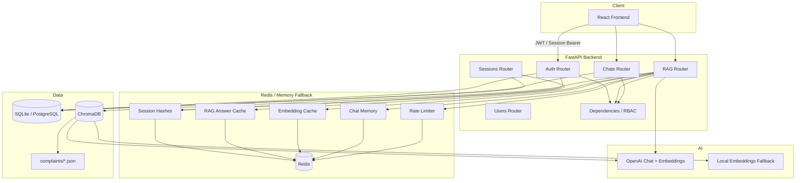
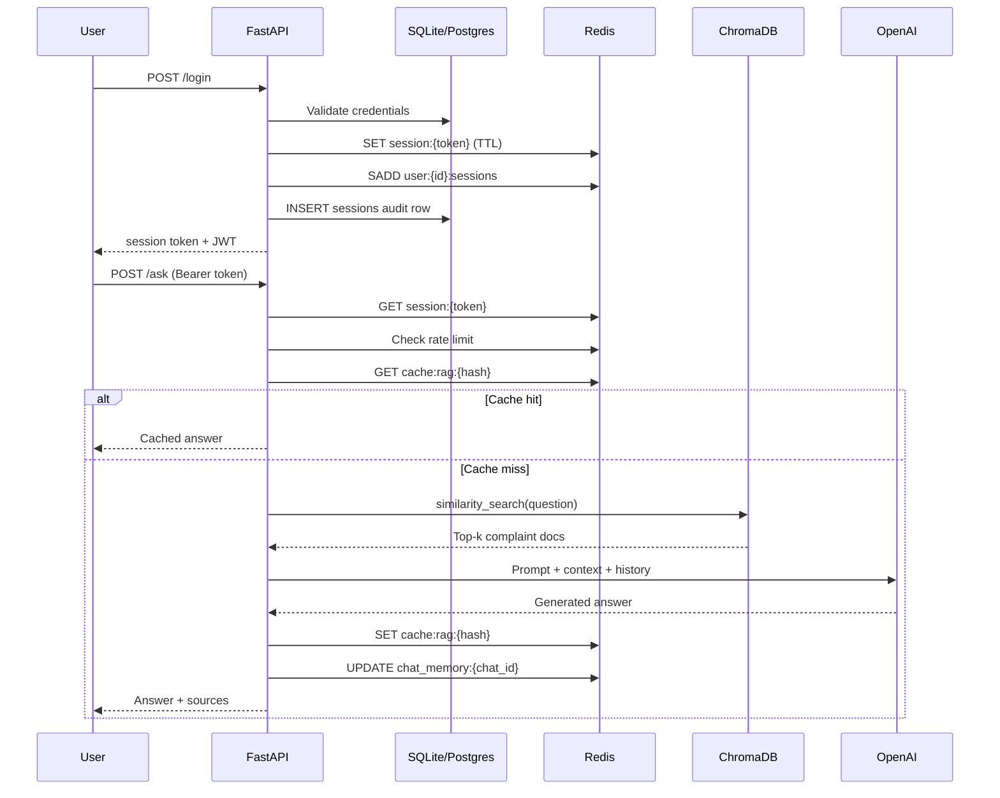

# Buiild Complaint RAG — Architecture

Production-grade complaint retrieval-augmented generation (RAG) platform with Redis-backed sessions, ChromaDB vector search, LangChain orchestration, and role-based access control.

## System Architecture



## Data Flow: Login → Session → RAG Query



## Module Layout

```
backend/app/
├── config.py          # Pydantic Settings (env vars)
├── redis_client.py    # Redis pool + in-memory fallback
├── cache.py           # Cache-aside, decorators, rate limiting
├── database.py        # SQLite/PostgreSQL abstraction
├── users.py           # User CRUD + bcrypt
├── sessions.py        # Redis session lifecycle
├── auth.py            # JWT + session resolution
├── chroma_store.py    # ChromaDB indexing + retrieval
├── rag_chain.py       # LangChain RAG pipeline
├── schemas.py         # Pydantic request/response models
├── dependencies.py    # get_current_user, require_roles
├── main.py            # App factory, lifespan, /health
└── routers/
    ├── auth.py
    ├── sessions.py
    ├── users.py
    ├── rag.py
    └── chats.py
```

## API Reference

Base URL: `http://localhost:8000`

### Authentication

| Method | Path | Auth | Description |
|--------|------|------|-------------|
| POST | `/register` | None | Create user account |
| POST | `/login` | None | Login, returns session token + JWT |
| POST | `/logout` | Bearer | Revoke current session |
| GET | `/me` | Bearer | Current user profile |

**POST /register**
```json
{
  "email": "user@example.com",
  "password": "secret12",
  "full_name": "Jane Doe",
  "role": "analyst"
}
```
Response: `{ "user": { "id", "email", "full_name", "role", "is_active" } }`

**POST /login**
```json
{ "email": "demo@support.ai", "password": "demo123" }
```
Response: `{ "token": "...", "jwt": "...", "user": { ... } }`

### Sessions

| Method | Path | Auth | Description |
|--------|------|------|-------------|
| GET | `/sessions` | Bearer | List active sessions |
| DELETE | `/sessions/{id}` | Bearer | Revoke session by DB id |
| POST | `/sessions/refresh` | Bearer | Extend session TTL |

### Users (Admin only)

| Method | Path | Auth | Description |
|--------|------|------|-------------|
| GET | `/users` | Admin | List users |
| GET | `/users/{id}` | Admin | Get user |
| PUT | `/users/{id}` | Admin | Update user |
| DELETE | `/users/{id}` | Admin | Soft-delete user |

### RAG

| Method | Path | Auth | Description |
|--------|------|------|-------------|
| GET | `/health` | None | System health |
| GET | `/templates` | None | List prompt templates |
| POST | `/ask` | Bearer | RAG question answering |
| POST | `/upload` | Bearer | Upload complaint JSON |
| POST | `/reindex` | Bearer | Rebuild Chroma index |

**POST /ask**
```json
{
  "question": "How do we handle billing overcharges?",
  "template": "support",
  "chat_id": 1,
  "use_cache": true
}
```
Response: `{ "answer": "...", "sources": ["complaint_001.json"], "cached": false }`

Templates: `support`, `manager`, `analyst`

### Chats

| Method | Path | Auth | Description |
|--------|------|------|-------------|
| GET | `/chats` | Bearer | List user chats |
| POST | `/chat` | Bearer | Create chat |
| GET | `/chat/{id}/messages` | Bearer | Get messages |
| POST | `/chat/{id}/message` | Bearer | Save message |
| DELETE | `/chat/{id}` | Bearer | Delete chat |

## Redis Key Schema

| Key Pattern | Type | TTL | Purpose |
|-------------|------|-----|---------|
| `session:{token}` | String (JSON) | `SESSION_TTL_SECONDS` | Active session payload |
| `user:{user_id}:sessions` | Set | `SESSION_REFRESH_TTL_SECONDS` | Session token index |
| `cache:rag:{hash}` | String (JSON) | `RAG_CACHE_TTL_SECONDS` | Cached RAG answers |
| `cache:embeddings:{hash}` | String (JSON) | `EMBEDDING_CACHE_TTL_SECONDS` | Cached similarity results |
| `chat_memory:{chat_id}` | String (JSON) | `SESSION_TTL_SECONDS` | Conversation history |
| `ratelimit:{user_id}:{endpoint}:{bucket}` | String (int) | `RATE_LIMIT_WINDOW_SECONDS` | Rate limit counter |

Hash keys use SHA-256 of `(question + template + chat_id)` for RAG and `(query + k)` for embeddings.

## ChromaDB Collection Schema

- **Collection name:** `complaints` (configurable via `CHROMA_COLLECTION`)
- **Persist directory:** `data/chroma/`
- **Embedding model:** OpenAI `text-embedding-ada-002` (default) or `sentence-transformers/all-MiniLM-L6-v2` when `EMBEDDINGS_PROVIDER=local`

**Document structure:**
```
page_content: "Complaint: ...\nSolution: ..."
metadata:
  source: "complaint_001.json"
  path: "/full/path/to/file"
  index: 0
  topic: "billing" | "delivery" | "product" | ...
```

**Auto-seed:** On startup, all `data/complaints/*.json` files are indexed if the collection is empty.

## Session Lifecycle

1. **Create** — Login generates `secrets.token_urlsafe(32)`, stores hash in Redis + audit row in DB
2. **Validate** — Each request checks Redis; on miss, falls back to DB and rehydrates Redis
3. **Refresh** — `POST /sessions/refresh` resets TTL on `session:{token}`
4. **Revoke** — Deletes Redis key, removes from user set, marks DB row `revoked=1`
5. **Multi-device** — Each login creates independent session; all tracked in `user:{id}:sessions`

JWT tokens provide stateless fallback auth with claims: `sub`, `email`, `role`, `exp`.

## Cache Invalidation Strategy

| Cache | Invalidation |
|-------|--------------|
| RAG answers | TTL expiry (`RAG_CACHE_TTL_SECONDS`); key includes question hash + template + chat_id |
| Embeddings | TTL expiry; invalidated on reindex |
| Sessions | Explicit revoke or TTL expiry |
| Chat memory | TTL aligned with session; cleared on chat delete |

Manual invalidation: `POST /reindex` clears chroma doc count cache; upload adds new docs without full invalidation.

## Roles

| Role | Permissions |
|------|-------------|
| `admin` | Full user management |
| `manager` | RAG, chats, uploads |
| `analyst` | RAG, chats, uploads |
| `support` | RAG, chats, uploads |

## Environment Setup

### Prerequisites

- Python 3.11+
- Redis 7+ (optional; falls back to in-memory)
- OpenAI API key (for LLM answers; local embeddings available)

### Step-by-step (Local)

```bash
# 1. Clone and enter project
cd Buiild-main

# 2. Create virtual environment
python -m venv .venv
.venv\Scripts\activate        # Windows
# source .venv/bin/activate     # macOS/Linux

# 3. Install dependencies
pip install -r backend/requirements.txt

# 4. Configure environment
copy .env.example .env          # Windows
# cp .env.example .env          # macOS/Linux
# Edit .env and set OPENAI_API_KEY

# 5. Start Redis (optional)
docker run -d -p 6379:6379 redis:7-alpine

# 6. Start backend
set PYTHONPATH=.                # Windows
uvicorn backend.app.main:app --reload --port 8000

# 7. Start frontend (separate terminal)
cd frontend
npm install
npm run dev
```

### Demo Credentials

| Email | Password | Role |
|-------|----------|------|
| demo@support.ai | demo123 | manager |
| admin@support.ai | admin123 | admin |

## Deployment (Docker)

```bash
# Set API key in shell or .env
export OPENAI_API_KEY=sk-...

docker compose up --build
```

Services:
- **backend** — `http://localhost:8000`
- **redis** — `localhost:6379`
- **frontend** — `http://localhost:3000`

Data persists in `./data/` volume (SQLite, ChromaDB, complaints).

## Testing

```bash
set PYTHONPATH=.
pytest tests/ -v
```

## Load Benchmark

```bash
# Quick test (100 users)
python scripts/benchmark_load.py --users 100 --iterations 3

# Full 10k simulation
python scripts/benchmark_load.py --users 10000 --iterations 2 --concurrency 100
```

## Performance Considerations

1. **Redis** — Session and cache lookups are O(1); use Redis in production for multi-instance deployments
2. **RAG caching** — Identical questions with same template return instantly from cache
3. **Embedding cache** — Repeated similarity searches avoid Chroma round-trips
4. **ChromaDB** — Persistent on disk; first query after startup may be slower during indexing
5. **Rate limiting** — Default 60 requests/minute/user on `/ask`; tune via env vars
6. **Connection pooling** — Redis client reconnects on failure; DB uses per-request connections (SQLite) or psycopg2 (PostgreSQL)
7. **LangSmith** — Enable `LANGCHAIN_TRACING_V2=true` for production observability

## LangSmith Tracing

Set in `.env`:
```
LANGCHAIN_TRACING_V2=true
LANGCHAIN_API_KEY=ls-...
LANGCHAIN_PROJECT=complaint-rag
```

Traces include retriever calls, prompt assembly, and LLM invocations.
