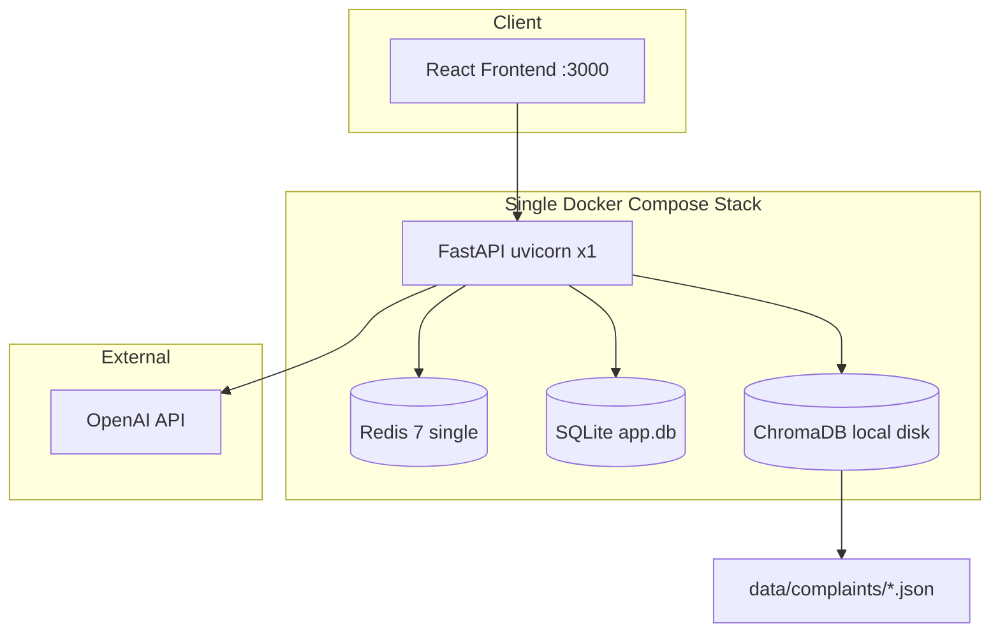
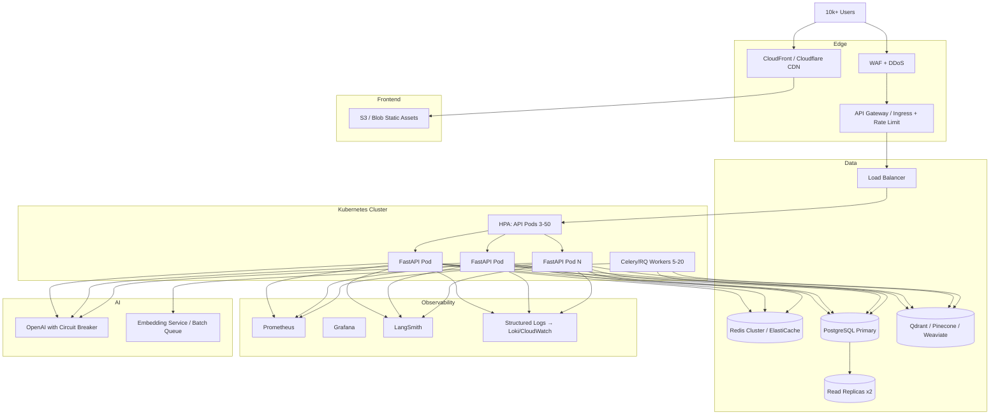

# Buiild Complaint RAG — Production Scaling Guide

This document captures the production scaling improvement plan for the Buiild Complaint RAG platform. It focuses on **how to scale from the current single-node MVP to 10k+ concurrent users**. For module layout, API reference, and deployment basics, see [ARCHITECTURE.md](./ARCHITECTURE.md).

---

## Executive Summary

The platform is a **well-structured single-node MVP**: FastAPI + Redis sessions/cache + ChromaDB + LangChain RAG, with PostgreSQL support already scaffolded. It is **not production-ready at 10k+ concurrent users** without infrastructure and application changes.

### Primary Bottlenecks Today

| Layer | Current State | Production Risk |
|-------|---------------|-----------------|
| **API** | Single `uvicorn` process, sync `/ask` | CPU-bound; blocks under load |
| **DB** | SQLite default, per-request connections | Write lock; no horizontal scale |
| **Redis** | Single node; in-memory fallback per pod | Sessions/cache not shared across replicas |
| **Vector DB** | Local Chroma on shared volume | Cannot scale replicas; startup reindex races |
| **LLM** | Sync OpenAI calls, no circuit breaker | Latency spikes, 429 cascades |
| **Frontend** | Dev server in compose, no CDN | Static assets not edge-cached |
| **Ops** | Basic `/health`, optional LangSmith | No SLOs, no readiness/liveness split |

### Highest-ROI Sequence

1. **Redis (required) + PostgreSQL + gunicorn workers** — enables multi-replica API safely
2. **Remove startup indexing; async workers for ingest** — prevents pod startup storms
3. **Managed vector DB** — replace local Chroma for horizontal RAG
4. **K8s HPA + load balancer + CDN** — elastic scale to 10k+ users
5. **Streaming, circuit breakers, observability stack** — reliability and perceived latency

**Estimated quick-win impact:** 5–10× throughput for auth/session routes; enables 2–4 API replicas safely.

---

## Architecture: Current vs Target

### Current (As-Implemented)

Single Docker Compose stack with one API process, local SQLite/Chroma, and optional Redis.



**Key scaling constraints:**

- `Dockerfile.backend` — single uvicorn worker
- `docker-compose.yml` — shared `./data` volume (SQLite + Chroma conflict with multiple backends)
- `main.py` lifespan — `ensure_indexed()` on every pod startup
- `redis_client.py` — in-memory fallback isolates cache per pod

### Target: 10k+ Concurrent Users



### Capacity Assumptions (10k Concurrent)

| Metric | Estimate |
|--------|----------|
| Active RAG queries | ~5–10% of users → 500–1000 RPS peak on `/ask` |
| Cache hit rate (30-min TTL) | ~40% → ~300–600 LLM calls/min |
| Required infrastructure | 8–15 API replicas, managed vector DB, Redis cluster, async job queue |

---

## Prioritized Roadmap

### Quick Wins (1–2 Weeks)

| # | Recommendation | Impact | Complexity | Files to Change |
|---|----------------|--------|------------|-----------------|
| 1 | **Require Redis in prod** — disable in-memory fallback when `ENV=production` | High | Low | `backend/app/redis_client.py`, `backend/app/config.py`, `docker-compose.yml` |
| 2 | **PostgreSQL + connection pooling** | High | Medium | `backend/app/database.py`, `backend/app/config.py`, compose/K8s secrets |
| 3 | **Multi-worker uvicorn/gunicorn** | High | Low | `Dockerfile.backend` |
| 4 | **Split health vs readiness probes** | Medium | Low | `backend/app/main.py` |
| 5 | **Secrets manager** — no `.env` in prod | High | Low–Med | `backend/app/config.py`, deploy manifests |
| 6 | **Fix rate limiter atomicity** (Redis `INCR`) | Medium | Low | `backend/app/cache.py` |
| 7 | **Tighten CORS + rotate JWT secret** | Medium | Low | `backend/app/config.py`, `.env.example`, `docker-compose.yml` |
| 8 | **Enable LangSmith in staging/prod** | Medium | Low | `backend/app/main.py`, env vars |
| 9 | **Tune cache TTLs for prod** | Medium | Low | `backend/app/config.py` |
| 10 | **Move indexing off startup** | High | Low–Med | `backend/app/main.py`, init job or worker |

### Medium Term (1–2 Months)

| # | Recommendation | Impact | Complexity | Files to Change |
|---|----------------|--------|------------|-----------------|
| 11 | **Kubernetes + HPA** | High | High | New `k8s/deployment.yaml`, `k8s/hpa.yaml`, `k8s/ingress.yaml` |
| 12 | **Load balancer + 3+ API replicas** | High | Medium | Ingress (nginx/ALB), prod compose overlay |
| 13 | **Redis Cluster / ElastiCache** | High | Medium | `backend/app/redis_client.py` |
| 14 | **Async workers (Celery/RQ)** for indexing, embeddings, long LLM | Very High | High | New `backend/app/tasks.py`, `workers/`; `backend/app/routers/rag.py` |
| 15 | **Migrate Chroma → managed vector DB** | Very High | High | New `backend/app/vector_store.py`; refactor `backend/app/chroma_store.py` |
| 16 | **Streaming `/ask` responses** | High | Medium | `backend/app/rag_chain.py`, `backend/app/routers/rag.py` |
| 17 | **Circuit breaker for OpenAI** | High | Medium | New `backend/app/llm_client.py`; `backend/app/rag_chain.py` |
| 18 | **API gateway rate limiting at edge** | High | Medium | Kong/AWS API Gateway; backstop in `backend/app/dependencies.py` |
| 19 | **CDN for frontend static assets** | Medium | Low–Med | Frontend build + S3/CloudFront |
| 20 | **Prometheus metrics + structured logging** | High | Medium | `backend/app/main.py`, new `middleware/metrics.py` |
| 21 | **PostgreSQL read replicas** for chat history | Medium | Medium | `backend/app/database.py`, `backend/app/routers/chats.py` |
| 22 | **Incremental indexing on upload** | Medium | Medium | `backend/app/chroma_store.py` |
| 23 | **Batch embedding on reindex** | Medium | Medium | `backend/app/chroma_store.py` |

**Managed vector DB options:**

| Option | Best For | Change Point |
|--------|----------|--------------|
| **Qdrant Cloud** | Self-host or managed; hybrid search built-in | Replace Chroma in `chroma_store.py` |
| **Pinecone** | Fully managed, minimal ops | New adapter, env `VECTOR_DB_URL` |
| **Weaviate** | Hybrid BM25 + vector native | New adapter + schema migration |

**Estimated medium-term impact:** 1k–3k concurrent RAG users; p95 `/ask` < 3s (cached) / < 8s (uncached).

### Long Term (3–6+ Months)

| # | Recommendation | Impact | Complexity | Files to Change |
|---|----------------|--------|------------|-----------------|
| 24 | **Hybrid search (BM25 + vector)** | High | High | `backend/app/rag_chain.py`; OpenSearch/Elasticsearch |
| 25 | **Partition collections by topic/date** | High | High | `backend/app/chroma_store.py` |
| 26 | **Session store sharding** | Medium | High | `backend/app/sessions.py` |
| 27 | **Multi-layer cache (Redis L1 + CDN edge)** | Medium | Medium | `backend/app/cache.py` |
| 28 | **SLOs + alerting** | High | Medium | Grafana dashboards |
| 29 | **PII handling pipeline** | Critical (compliance) | High | `backend/app/chroma_store.py`, audit logs |
| 30 | **RBAC hardening + audit trail** | High | Medium | `backend/app/dependencies.py`, `backend/app/users.py` |
| 31 | **Model routing by role** | Medium | Medium | `backend/app/config.py`, `backend/app/rag_chain.py` |
| 32 | **Embedding pre-computation pipeline** | High | High | `scripts/`, vector DB ingest |
| 33 | **Multi-region active-active** | Very High | Very High | Full infra redesign |

---

## Impact vs Complexity

| Recommendation | Impact | Complexity |
|----------------|--------|------------|
| Async workers (Celery/RQ) | Very High | High |
| Managed vector DB (Qdrant/Pinecone/Weaviate) | Very High | High |
| Kubernetes + HPA | Very High | High |
| Require Redis in prod | Very High | Low |
| PostgreSQL + connection pooling | High | Medium |
| Streaming `/ask` | High | Medium |
| OpenAI circuit breaker | High | Medium |
| CDN for frontend | High | Low–Med |
| Multi-worker gunicorn | High | Low |
| Prometheus + structured logging | High | Medium |
| Secrets manager | High | Low–Med |
| Hybrid search | High | High |
| Read replicas | Medium | Medium |
| PII redaction pipeline | Medium (compliance: Critical) | High |
| Rate limiter atomicity fix | Medium | Low |
| Cache TTL tuning | Medium | Low |
| LangSmith in prod | Medium | Low |
| CORS / JWT hardening | Medium | Low |

```
Impact ▲
  Very High │ [Async Workers] [Managed Vector DB] [K8s+HPA]
            │ [PostgreSQL+Pool] [Require Redis]
  High      │ [Streaming] [Circuit Breaker] [CDN]
            │ [Multi-worker] [Prometheus] [Secrets Mgr]
  Medium    │ [Hybrid Search] [Read Replicas] [PII]
            │ [Rate Limit Fix] [Cache TTL Tune]
  Low       │ [LangSmith] [CORS tighten]
            └──────────────────────────────────────► Complexity
              Low        Medium        High
```

---

## Bottleneck Deep-Dive (Code-Level)

### 1. SQLite — per-request connections, write lock

**File:** `backend/app/database.py`

- New connection per query; SQLite write lock under concurrent registration/login
- **Fix:** `DATABASE_URL=postgresql://...` + connection pool (`psycopg2.pool` or pgbouncer sidecar)

### 2. Single uvicorn worker

**File:** `Dockerfile.backend`

```dockerfile
CMD ["uvicorn", "backend.app.main:app", "--host", "0.0.0.0", "--port", "8000"]
```

- One process handles all requests; LLM wait blocks other users

### 3. In-memory Redis fallback

**File:** `backend/app/redis_client.py`

- On Redis failure, each pod gets isolated cache/sessions — **breaks multi-replica auth**

### 4. Sync RAG pipeline

**Files:** `backend/app/rag_chain.py`, `backend/app/routers/rag.py`

- `chain.invoke()` blocks for full LLM latency; no timeout, no streaming

### 5. Chroma on local disk

**File:** `docker-compose.yml`

- Shared `./data` volume: multiple API replicas → file corruption / inconsistent Chroma reads

### 6. Non-atomic rate limit

**File:** `backend/app/cache.py`

- Read-modify-write race on rate limit counter under concurrent requests from same user
- **Fix:** Redis `INCR` + `EXPIRE` or Lua script

### 7. Startup indexing

**File:** `backend/app/main.py`

- `ensure_indexed()` on every pod; concurrent pods → duplicate work and startup storms

---

## Quick-Win: Gunicorn in Dockerfile

Replace the single uvicorn process in `Dockerfile.backend`:

```dockerfile
# Add gunicorn to backend/requirements.txt if not present:
# gunicorn>=21.0

# Dockerfile.backend — production CMD
CMD ["gunicorn", "backend.app.main:app", \
     "-k", "uvicorn.workers.UvicornWorker", \
     "-w", "4", \
     "-b", "0.0.0.0:8000", \
     "--timeout", "120"]
```

**Notes:**

- Start with `-w 4`; scale workers to `(2 × CPU cores) + 1` per host
- `--timeout 120` accommodates slow LLM responses on `/ask`
- For K8s, prefer multiple pods × fewer workers over one pod × many workers
- Chroma singletons are not fork-safe — move to managed vector DB before heavy multi-worker scale

---

## Health Probe Endpoints (Recommended)

The current `/health` endpoint (`backend/app/main.py`) returns status but does not fail on degraded dependencies. For Kubernetes and load balancer rollouts, split probes:

### `/health/live` — Liveness

- **Purpose:** Is the process alive?
- **Check:** Return 200 if the FastAPI process responds
- **K8s action:** Restart pod on failure
- **Implementation:** `backend/app/main.py` — minimal handler, no external deps

```python
@app.get("/health/live")
def liveness() -> dict[str, str]:
    return {"status": "alive"}
```

### `/health/ready` — Readiness

- **Purpose:** Can this pod accept traffic?
- **Checks:**
  - Redis ping (required in prod; fail if fallback active)
  - PostgreSQL `SELECT 1`
  - Vector DB document count > 0
  - OpenAI reachable (optional lightweight check or config flag)
- **K8s action:** Remove from load balancer on failure
- **Implementation:** `backend/app/main.py` — return 503 if any required dep fails

```python
@app.get("/health/ready")
def readiness() -> dict[str, Any]:
    checks = {}
    ok = True

    redis = get_redis()
    checks["redis"] = redis.is_redis_available
    if settings.env == "production" and not redis.is_redis_available:
        ok = False

    try:
        get_db().execute("SELECT 1")
        checks["database"] = True
    except Exception:
        checks["database"] = False
        ok = False

    try:
        doc_count = get_chroma_store().document_count()
        checks["vector_db"] = doc_count > 0
        if doc_count == 0:
            ok = False
    except Exception:
        checks["vector_db"] = False
        ok = False

    status_code = 200 if ok else 503
    return JSONResponse(
        status_code=status_code,
        content={"status": "ready" if ok else "not_ready", "checks": checks},
    )
```

### Kubernetes Probe Configuration (Reference)

```yaml
livenessProbe:
  httpGet:
    path: /health/live
    port: 8000
  initialDelaySeconds: 10
  periodSeconds: 15

readinessProbe:
  httpGet:
    path: /health/ready
    port: 8000
  initialDelaySeconds: 5
  periodSeconds: 10
  failureThreshold: 3
```

### SLO Targets (Post-Observability)

| Metric | Target |
|--------|--------|
| Availability | 99.9% |
| `/ask` p95 (uncached) | < 5s |
| `/ask` p95 (cached) | < 200ms |
| Error rate | < 0.5% |

**Prometheus metrics to add:** `http_request_duration_seconds`, `rag_cache_hit_ratio`, `openai_requests_total`, `openai_tokens_total`

**Files:** `backend/app/main.py`, new `backend/app/middleware/metrics.py`, `backend/app/config.py`

---

## Caching & Performance Tuning

### Recommended Production TTLs

| Cache | Current (`config.py`) | Recommended | Rationale |
|-------|----------------------|-------------|-----------|
| RAG answers | 30 min | 1–4 hr | Complaints change infrequently |
| Embeddings | 24 hr | 7 days | Query patterns repeat |
| Sessions | 24 hr | 24 hr | OK as-is |
| Chat memory | 24 hr (Redis) | PG + Redis L1 | Survive Redis flush |

**Env example:**

```bash
RAG_CACHE_TTL_SECONDS=3600
EMBEDDING_CACHE_TTL_SECONDS=604800
```

### Cache Invalidation Gaps

- Upload does not invalidate RAG cache — add version prefix or namespace invalidation in `backend/app/cache.py`
- `chat_id` in RAG cache key lowers hit rate for multi-turn chats — consider `rag:{hash}:no_history` for FAQ-style queries

**Files:** `backend/app/cache.py`, `backend/app/rag_chain.py`, `backend/app/chroma_store.py`, `backend/app/sessions.py`

---

## Cost Optimization

| Strategy | Savings | Implementation |
|----------|---------|----------------|
| `EMBEDDINGS_PROVIDER=local` in dev/staging | ~100% embed cost in non-prod | `backend/app/config.py` |
| `text-embedding-3-small` vs ada-002 | ~50% embed cost | `backend/app/chroma_store.py` |
| Aggressive RAG cache (1–4 hr TTL) | 40–60% fewer LLM calls | `backend/app/config.py` |
| Role-based models (support→mini, analyst→gpt-4o) | 20–40% | `backend/app/rag_chain.py` |
| Batch reindex via overnight worker | Avoid peak-hour embed spikes | Celery beat |
| Semantic cache (similar questions) | +15–25% hit rate | New layer in `backend/app/cache.py` |

---

## Security & Compliance (Scaling Prerequisites)

| Gap | Risk | Fix | Files |
|-----|------|-----|-------|
| Default JWT secret | Token forgery | Secrets manager + rotation | `backend/app/config.py` |
| `CORS_ORIGINS=["*"]` | CSRF exposure | Restrict to frontend origin | `backend/app/config.py` |
| PII in complaint JSON | Compliance violation | Redact before indexing | `backend/app/chroma_store.py` |
| JWT bypasses session revocation | Stale auth | Session-only auth in prod | `backend/app/auth.py` |
| Any user can `/reindex` | Abuse / DoS | Admin-only RBAC | `backend/app/routers/rag.py`, `backend/app/dependencies.py` |

---

## Concrete Next Steps

### Week 1

1. Set `DATABASE_URL` to PostgreSQL (RDS / Cloud SQL)
2. Deploy Redis as required (ElastiCache); fail fast if unavailable when `ENV=production`
3. Update `Dockerfile.backend` to gunicorn + 4 workers (see snippet above)
4. Add `/health/live` and `/health/ready` with dependency checks
5. Move secrets to secrets manager; rotate `JWT_SECRET`
6. Fix rate limiter to use Redis `INCR` in `backend/app/cache.py`
7. Remove `ensure_indexed()` from `main.py` lifespan; run one-time init job instead

### Week 2–4

8. Add Celery + Redis broker; async `upload` / `reindex` in `backend/app/routers/rag.py`
9. Add Prometheus metrics + Grafana dashboard
10. Enable LangSmith in staging via `backend/app/main.py`
11. Implement streaming `/ask` with `StreamingResponse` in `backend/app/routers/rag.py`
12. Add OpenAI circuit breaker (tenacity/pybreaker) in new `backend/app/llm_client.py`
13. Build static frontend (`npm run build`) + CDN deploy

### Month 2+

14. Migrate to Qdrant / Pinecone (abstract `VectorStore` in `backend/app/vector_store.py`)
15. K8s deployment with HPA (min 3, max 20 pods)
16. API gateway with edge rate limiting
17. Hybrid search POC in `backend/app/rag_chain.py`
18. PII redaction pipeline in `backend/app/chroma_store.py`
19. RBAC on `/reindex` → admin only
20. Collection partitioning by topic in `backend/app/chroma_store.py`
21. PostgreSQL read replicas for `backend/app/routers/chats.py`
22. SLO dashboards + alerting (Grafana)
23. Cost dashboards (tokens per request)
24. Load test staging: `python scripts/benchmark_load.py --users 10000 --concurrency 100`

---

## File Reference Index

| Area | Primary Files |
|------|---------------|
| Config / env | `backend/app/config.py`, `.env.example` |
| Deployment | `docker-compose.yml`, `Dockerfile.backend` |
| Redis | `backend/app/redis_client.py` |
| Cache / rate limit | `backend/app/cache.py` |
| Sessions | `backend/app/sessions.py` |
| Database | `backend/app/database.py` |
| RAG pipeline | `backend/app/rag_chain.py`, `backend/app/routers/rag.py` |
| Vector store | `backend/app/chroma_store.py` |
| Auth / RBAC | `backend/app/auth.py`, `backend/app/dependencies.py` |
| Health / app lifecycle | `backend/app/main.py` |
| Load testing | `scripts/benchmark_load.py` |
| Future: workers | `backend/app/tasks.py` (new) |
| Future: LLM client | `backend/app/llm_client.py` (new) |
| Future: K8s | `k8s/deployment.yaml`, `k8s/hpa.yaml`, `k8s/ingress.yaml` (new) |

---

## Related Documentation

- [ARCHITECTURE.md](./ARCHITECTURE.md) — system design, API reference, local setup
- Load benchmark: `scripts/benchmark_load.py`
