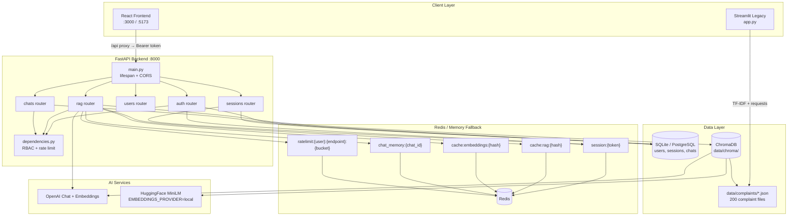
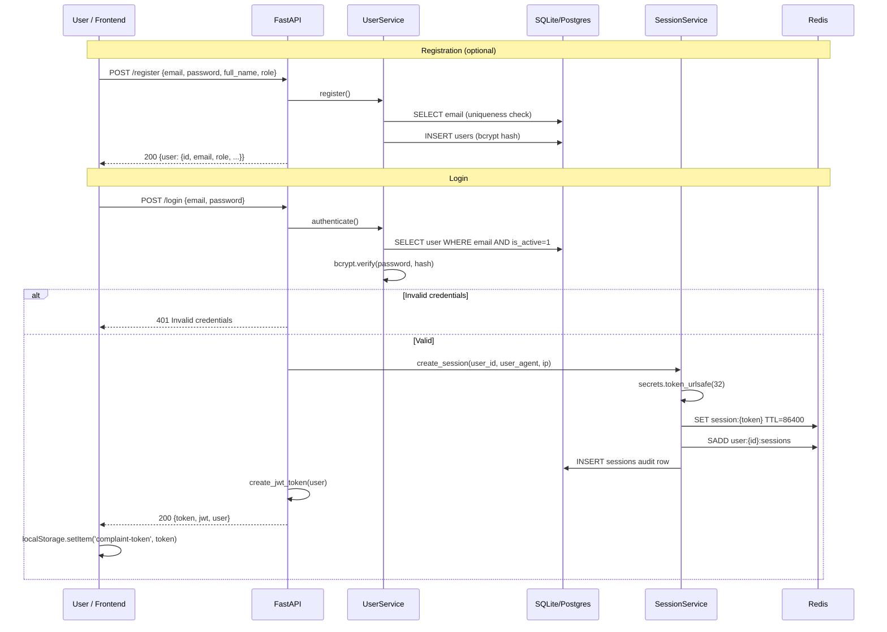
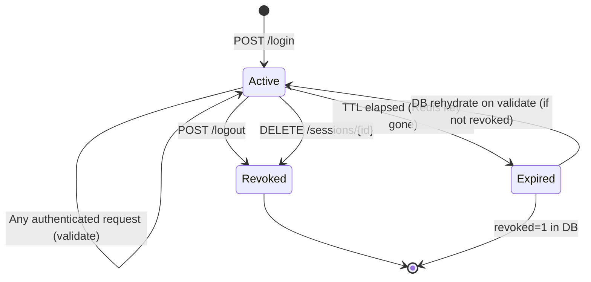
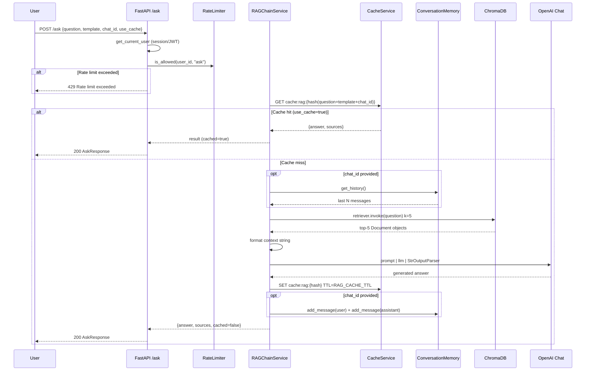
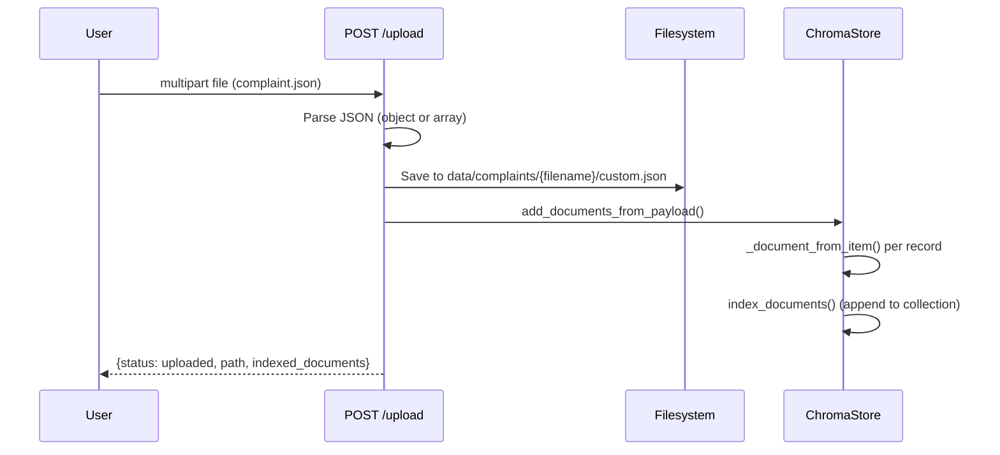
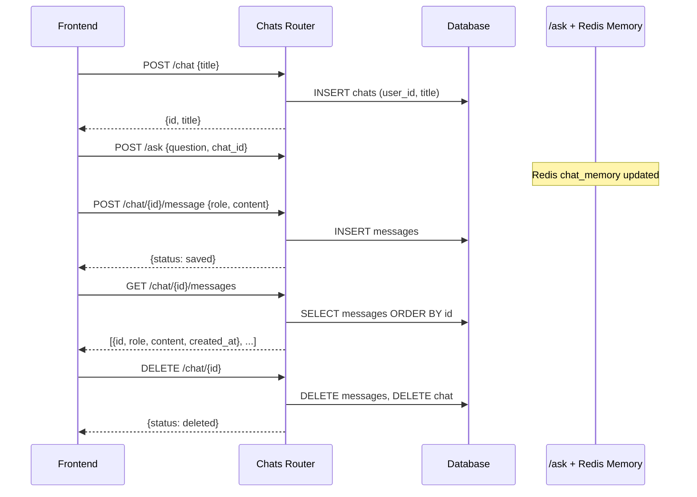
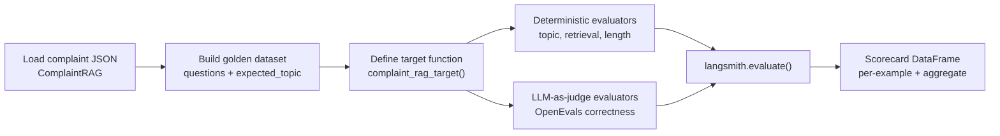
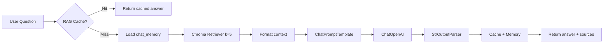

# Buiild Complaint RAG — Complete Project Guide

> **Version:** 2.0.0  
> **Last updated:** July 2026  
> **Audience:** Developers, operators, and support engineers working with the Buiild Complaint RAG platform.

This document is the **single comprehensive reference** for the entire project. It covers architecture, workflows, setup, API reference, data models, RAG pipeline internals, testing, benchmarking, deployment, troubleshooting, and development notes.

For focused deep dives, see also:

- [ARCHITECTURE.md](./ARCHITECTURE.md) — system design, module layout, Redis schema
- [PRODUCTION_SCALING.md](./PRODUCTION_SCALING.md) — scaling from MVP to 10k+ concurrent users

---

## Table of Contents

1. [Project Overview](#1-project-overview)
2. [System Architecture](#2-system-architecture)
3. [Complete Workflow](#3-complete-workflow)
4. [Project Structure](#4-project-structure)
5. [Setup & Installation](#5-setup--installation)
6. [Running the Application](#6-running-the-application)
7. [API Reference](#7-api-reference)
8. [Data Models & Storage](#8-data-models--storage)
9. [LangChain & RAG Pipeline](#9-langchain--rag-pipeline)
10. [Authentication & Authorization](#10-authentication--authorization)
11. [Frontend Guide](#11-frontend-guide)
12. [Testing](#12-testing)
13. [Benchmarking & Performance](#13-benchmarking--performance)
14. [Deployment](#14-deployment)
15. [Troubleshooting](#15-troubleshooting)
16. [Development Notes](#16-development-notes)
17. [Appendix](#17-appendix)

---

## 1. Project Overview

### What This Project Is

**Buiild Complaint RAG** is a production-oriented **Retrieval-Augmented Generation (RAG)** platform for customer complaint handling. It lets support teams, managers, and analysts ask natural-language questions about historical complaints and receive AI-generated answers grounded in a curated knowledge base of complaint records and their resolutions.

The platform combines:

- A **FastAPI** backend with role-based access control (RBAC)
- **Redis** for sessions, caching, rate limiting, and conversation memory
- **ChromaDB** for vector similarity search over complaint documents
- **LangChain** for orchestrating retrieval, prompt assembly, and LLM calls
- **OpenAI** (or local embeddings) for embeddings and answer generation
- A **React** frontend (Support Operations Console) for login, chat, uploads, and dashboards
- A legacy **Streamlit** prototype (`app.py`) using TF-IDF retrieval

### Purpose

Organizations accumulate complaint data in JSON files, CRM exports, or ticket archives. This project turns that static data into an **interactive intelligence layer**:

1. **Support agents** get empathetic, action-oriented answers (`support` template)
2. **Managers** get executive summaries of resolution strategies (`manager` template)
3. **Analysts** get pattern analysis across similar complaints (`analyst` template)

The system is designed as an MVP that can scale toward production (see [PRODUCTION_SCALING.md](./PRODUCTION_SCALING.md)).

### Tech Stack Summary

| Layer | Technology | Role |
|-------|------------|------|
| **API** | FastAPI 0.111+, Uvicorn | REST API, lifespan hooks, CORS |
| **Auth** | bcrypt, PyJWT, Redis sessions | Registration, login, session lifecycle |
| **Database** | SQLite (default) / PostgreSQL | Users, sessions audit, chats, messages |
| **Cache** | Redis 7+ (in-memory fallback) | RAG cache, embedding cache, rate limits |
| **Vector DB** | ChromaDB via langchain-chroma | Persistent complaint embeddings |
| **RAG** | LangChain 0.3+, langchain-openai | Retriever, prompts, ChatOpenAI |
| **LLM** | OpenAI `gpt-4o-mini` (configurable) | Answer generation |
| **Embeddings** | OpenAI ada-002 or HuggingFace MiniLM | Document/query vectors |
| **Frontend** | React 18, Vite 5, Recharts, Lucide | SPA with `/api` proxy |
| **Legacy UI** | Streamlit, scikit-learn TF-IDF | Standalone prototype |
| **Eval** | LangSmith, OpenEvals, Jupyter | LLM evaluation notebook |
| **Ops** | Docker Compose, pytest, httpx benchmark | Containerized deploy, tests, load test |

### High-Level Capabilities

| Capability | Description |
|------------|-------------|
| **User management** | Register, login, logout, profile; admin CRUD on users |
| **Session management** | Multi-device sessions, refresh TTL, revoke by session ID |
| **RAG Q&A** | Ask questions with template selection, source attribution, caching |
| **Document upload** | Upload complaint JSON; auto-index into ChromaDB |
| **Full reindex** | Rebuild vector index from all files in `data/complaints/` |
| **Chat persistence** | Create chats, store messages in SQLite/PostgreSQL |
| **Conversation memory** | Redis-backed history per `chat_id` for multi-turn RAG |
| **Rate limiting** | Per-user sliding window on `/ask` (default 60/min) |
| **Health monitoring** | `/health` reports Redis, DB, Chroma, OpenAI status |
| **Demo dataset** | Auto-generates 200 detailed complaint JSON files on first run |
| **Load benchmarking** | Simulates 10k+ users with async httpx workers |
| **LLM evaluation** | Golden dataset + deterministic and LLM-as-judge evaluators |

---

## 2. System Architecture

### Full-Stack Architecture Diagram



### Component Descriptions

#### Frontend (React)

Single-page application in `frontend/src/App.jsx`. Provides login, dashboard with charts, AI assistant chat, knowledge base upload, reports, and settings. All API calls go through `/api` which Vite proxies to the backend.

#### FastAPI Backend

Application factory in `backend/app/main.py`. On startup:

1. Configures optional LangSmith tracing
2. Initializes database schema (`init_db`)
3. Seeds demo users (`demo@support.ai`, `admin@support.ai`)
4. Connects Redis (or falls back to in-memory)
5. Indexes complaints into ChromaDB if collection is empty (`ensure_indexed`)

Routers are mounted without path prefixes — all endpoints are at the root (e.g. `/login`, `/ask`).

#### Redis

When `REDIS_ENABLED=true` and Redis is reachable, the platform uses Redis for:

- Session storage (`session:{token}`)
- User session index (`user:{id}:sessions`)
- RAG answer cache (`cache:rag:{hash}`)
- Embedding search cache (`cache:embeddings:{hash}`)
- Chat conversation memory (`chat_memory:{chat_id}`)
- Rate limit counters (`ratelimit:{user_id}:{endpoint}:{bucket}`)

If Redis is unavailable, `redis_client.py` falls back to a thread-safe in-memory store. This works for single-process development but **breaks multi-replica deployments** (see PRODUCTION_SCALING.md).

#### ChromaDB

Persistent vector store at `data/chroma/` (configurable via `CHROMA_PERSIST_DIR`). Collection name defaults to `complaints`. Documents are embedded at index time and retrieved via similarity search at query time.

#### SQLite / PostgreSQL

Default: SQLite at `data/app.db`. Set `DATABASE_URL=postgresql://...` for PostgreSQL (requires `psycopg2-binary`). Stores users, session audit rows, chats, and messages.

#### OpenAI

Used for:

- **Chat completions** — `ChatOpenAI` in `rag_chain.py` (model from `OPENAI_MODEL`)
- **Embeddings** — `OpenAIEmbeddings` in `chroma_store.py` when `EMBEDDINGS_PROVIDER=openai`

Without `OPENAI_API_KEY`, the RAG endpoint still returns retrieved context but cannot generate LLM answers.

### Related Documentation

| Document | Focus |
|----------|-------|
| [ARCHITECTURE.md](./ARCHITECTURE.md) | Module layout, Redis key schema, session lifecycle, cache invalidation |
| [PRODUCTION_SCALING.md](./PRODUCTION_SCALING.md) | Bottlenecks, K8s target architecture, gunicorn, health probes, roadmap |

---

## 3. Complete Workflow

This section walks through every major user journey with sequence diagrams and step-by-step narrative.

### 3.1 User Registration & Login Flow



**Step-by-step narrative:**

1. **Registration** — User submits email, password (min 6 chars), full name, and optional role (`analyst` default). `UserService.register()` validates email format, checks uniqueness, hashes password with bcrypt, and inserts into `users` table. Returns public user object (no password hash).

2. **Login** — User submits email and password. `UserService.authenticate()` fetches active user and verifies bcrypt hash. On success:
   - `SessionService.create_session()` generates a 32-byte URL-safe token
   - Token payload (user_id, created_at, user_agent, ip) stored in Redis with `SESSION_TTL_SECONDS` (default 24h)
   - Token added to user's session set in Redis
   - Audit row inserted in `sessions` table
   - JWT created with claims: `sub`, `email`, `role`, `exp`
   - Both `token` (session) and `jwt` returned to client

3. **Frontend persistence** — React app stores session `token` in `localStorage` under key `complaint-token`. Subsequent requests send `Authorization: Bearer {token}`.

4. **Session restore on page load** — `useEffect` calls `GET /me` with stored token. If valid, user is redirected to dashboard; if 401, token is cleared.

### 3.2 Session Lifecycle



| Phase | Mechanism | Details |
|-------|-----------|---------|
| **Create** | `POST /login` | `secrets.token_urlsafe(32)` → Redis `session:{token}` + DB audit |
| **Validate** | Every `get_current_user` call | Redis lookup first; on miss, DB lookup + rehydrate Redis if `revoked=0` |
| **Refresh** | `POST /sessions/refresh` | `EXPIRE session:{token}` with `SESSION_TTL_SECONDS` |
| **Revoke** | `POST /logout` or `DELETE /sessions/{id}` | Delete Redis key, `SREM` from user set, `UPDATE sessions SET revoked=1` |
| **Multi-device** | Multiple logins | Each login creates independent token; all tracked in `user:{id}:sessions` |

**JWT fallback:** If session token is expired/revoked in Redis but JWT is still valid, `resolve_user_from_token()` can authenticate via JWT. Note: JWT bypasses session revocation — a production hardening item (see PRODUCTION_SCALING.md).

### 3.3 RAG Query Workflow



**Step-by-step narrative:**

1. **Authentication** — `rate_limit("ask")` dependency resolves user via Bearer token.
2. **Rate limiting** — Sliding window counter per user per endpoint. Default: 60 requests per 60 seconds.
3. **Cache check** — SHA-256 hash of `question|template|chat_id` → `cache:rag:{hash}`. If hit and `use_cache=true`, return immediately.
4. **Conversation memory** — If `chat_id` is set, load up to 20 messages from `chat_memory:{chat_id}` in Redis.
5. **Retrieval** — Chroma retriever fetches top-5 similar complaint documents. Embedding search may itself be cached under `cache:embeddings:{hash}`.
6. **Prompt assembly** — Selected template (`support`, `manager`, `analyst`) injects system instructions, `{context}`, optional `{history}`, and `{question}`.
7. **LLM invocation** — `ChatOpenAI` with `temperature=0.2` generates answer.
8. **Cache store** — Result cached for `RAG_CACHE_TTL_SECONDS` (default 30 min).
9. **Memory update** — User question and assistant answer appended to Redis chat memory.
10. **Response** — `{answer, sources[], cached}` returned. Sources are filenames from document metadata.

**No OpenAI key path:** If `OPENAI_API_KEY` is empty, the system attempts retrieval only and returns either raw context or a message asking to configure the key.

### 3.4 Document Upload & Indexing Workflow



**Indexing on startup:**

```
main.py lifespan → get_chroma_store().ensure_indexed()
  → load_documents_from_json(DATA_DIR)
    → seed_demo_data() if no JSON files exist (generates 200 files)
    → glob all *.json recursively
    → build Document(page_content, metadata) per item
  → if document_count == 0: index_documents(docs)
```

**Full reindex** (`POST /reindex`):

1. Reload all documents from `DATA_DIR`
2. `index_documents(docs, replace=True)` — deletes collection, rebuilds from scratch
3. Returns `{status: reindexed, document_count}`

### 3.5 Chat History Workflow



**Dual persistence:** Chat messages exist in two places:

1. **SQLite/PostgreSQL** — durable storage via `/chat/{id}/message` endpoints (frontend saves after each `/ask`)
2. **Redis `chat_memory:{chat_id}`** — used by RAG for multi-turn context (max 20 messages)

Deleting a chat removes DB records but does not explicitly clear Redis memory (TTL expiry handles cleanup).

### 3.6 Evaluation Workflow (Notebook)

The notebook `notebooks/llm_evaluation_langchain_evals.ipynb` evaluates the **legacy TF-IDF RAG** (`src/complaint_rag.py`), not the production LangChain pipeline. It demonstrates evaluation patterns applicable to both.



**Steps:**

1. **Setup** — Load `.env`, instantiate `ComplaintRAG` from `data/complaints/`
2. **Golden dataset** — 5+ examples with `inputs.question` and `outputs.expected_topic` / `reference_answer`
3. **Target function** — Wraps `rag.answer(question)` for LangSmith
4. **Deterministic evaluators** — `topic_keyword_evaluator`, `retrieval_relevance_evaluator`, `answer_length_evaluator`
5. **LangSmith evaluate()** — Runs all examples with `upload_results=False` (local, no API key required)
6. **Scorecard** — Pandas DataFrame with per-evaluator scores
7. **LLM-as-judge** (optional) — OpenEvals correctness/helpfulness when `OPENAI_API_KEY` is set

---

## 4. Project Structure

### Directory Tree

```
Buiild-main/
├── .env                          # Local environment (not committed; copy from .env.example)
├── .env.example                  # Template for all environment variables
├── Readme.md                     # Quick-start README
├── app.py                        # Legacy Streamlit TF-IDF chatbot (standalone)
├── requirements.txt              # Root deps: Streamlit, sklearn, openevals (notebook/legacy)
├── docker-compose.yml            # Redis + backend + frontend services
├── Dockerfile.backend            # Python 3.11-slim API container
│
├── backend/
│   ├── __init__.py
│   ├── requirements.txt          # FastAPI, LangChain, Chroma, Redis, pytest, etc.
│   ├── data/                     # Alternate data path (may mirror root data/)
│   │   ├── app.db                # SQLite if backend cwd used
│   │   └── complaints/           # Complaint JSON files (duplicate of root data/)
│   └── app/
│       ├── __init__.py
│       ├── main.py               # FastAPI app factory, lifespan, /health
│       ├── config.py             # Pydantic Settings from .env
│       ├── database.py           # SQLite/PostgreSQL abstraction, schema, seed
│       ├── users.py              # UserService: register, auth, CRUD
│       ├── sessions.py           # SessionService: Redis + DB audit
│       ├── auth.py               # JWT create/decode, resolve_user_from_token
│       ├── dependencies.py       # get_current_user, require_roles, rate_limit
│       ├── cache.py              # CacheService, RateLimiter, @cached decorator
│       ├── redis_client.py       # Redis wrapper + InMemoryStore fallback
│       ├── chroma_store.py       # ChromaDB indexing, retrieval, demo seed
│       ├── rag_chain.py          # LangChain RAG pipeline, prompts, memory
│       ├── schemas.py            # Pydantic request/response models
│       └── routers/
│           ├── __init__.py
│           ├── auth.py           # /register, /login, /logout, /me
│           ├── sessions.py       # /sessions, /sessions/{id}, /sessions/refresh
│           ├── users.py          # /users CRUD (admin only)
│           ├── rag.py            # /templates, /ask, /upload, /reindex
│           └── chats.py          # /chats, /chat, /chat/{id}/messages
│
├── frontend/
│   ├── index.html                # Vite entry HTML
│   ├── package.json              # React, Vite, Recharts, Lucide
│   ├── vite.config.js            # Dev server :3000, /api proxy → backend
│   ├── dist/                     # Production build output
│   └── src/
│       ├── main.jsx              # ReactDOM.createRoot
│       └── App.jsx               # Full SPA: login, dashboard, assistant, upload
│
├── src/                          # Shared Python modules (used by backend + notebooks)
│   ├── __init__.py
│   ├── complaint_dataset.py      # Generates 200 detailed complaint JSON records
│   └── complaint_rag.py        # Legacy TF-IDF RAG (Streamlit + notebook)
│
├── data/                         # Primary runtime data directory
│   ├── app.db                    # SQLite database (default)
│   ├── chroma/                   # ChromaDB persistence (created at runtime)
│   └── complaints/               # 200 complaint_001.json … complaint_200.json
│
├── docs/
│   ├── ARCHITECTURE.md           # System design reference
│   ├── PRODUCTION_SCALING.md     # Scaling roadmap to 10k+ users
│   └── PROJECT_GUIDE.md          # This document
│
├── notebooks/
│   ├── llm_evaluation_langchain_evals.ipynb          # Evaluation notebook (source)
│   └── llm_evaluation_langchain_evals.executed.ipynb   # Executed with outputs
│
├── scripts/
│   ├── benchmark_load.py         # Async load test (10k users)
│   ├── download_complaints.py    # CLI to generate complaint JSON files
│   └── reindex_chroma.py         # CLI to rebuild Chroma index
│
└── tests/
    ├── conftest.py               # Test fixtures, env isolation, TestClient
    ├── test_auth.py              # Health, register, login, me, logout, admin RBAC
    ├── test_sessions.py          # Multi-session, revoke, refresh
    ├── test_rag.py               # /ask, /templates, validation errors
    ├── test_cache.py             # Cache get/set, hash_key
    └── test_chroma.py            # Demo dataset, document loading, indexing
```

### Major Folder Explanations

| Path | Purpose |
|------|---------|
| `backend/app/` | Production API — all business logic lives here |
| `backend/app/routers/` | Thin HTTP handlers; delegate to services |
| `src/` | Dataset generation and legacy RAG; imported by backend (`chroma_store`) and notebooks |
| `data/` | Default persistence root for SQLite, Chroma, and complaint JSON |
| `frontend/src/` | React SPA — single `App.jsx` component (~500 lines) |
| `notebooks/` | LLM evaluation experiments with LangSmith + OpenEvals |
| `scripts/` | Operational CLIs for reindex, dataset generation, load testing |
| `tests/` | pytest suite with isolated temp DB/Chroma per session |
| `docs/` | Architecture, scaling, and this project guide |

**Note:** `backend/data/` may contain a duplicate copy of complaints and `app.db` depending on how the server was started. The canonical paths are controlled by `DB_PATH`, `DATA_DIR`, and `CHROMA_PERSIST_DIR` in `.env` (defaults point to project-root `data/`).

---

## 5. Setup & Installation

### Prerequisites

| Requirement | Version | Required? | Notes |
|-------------|---------|-----------|-------|
| Python | 3.11+ | Yes | Backend, tests, scripts, notebooks |
| Node.js | 18+ | For frontend | `npm install` in `frontend/` |
| Redis | 7+ | Optional | Falls back to in-memory; recommended for production |
| OpenAI API key | — | For LLM answers | Embeddings can use `local` provider |
| Docker + Compose | — | Optional | Full stack deployment |

### Step-by-Step Local Setup

#### 1. Clone and enter project

```bash
cd Buiild-main
```

#### 2. Create Python virtual environment

```bash
python -m venv .venv

# Windows
.venv\Scripts\activate

# macOS/Linux
source .venv/bin/activate
```

#### 3. Install backend dependencies

```bash
pip install -r backend/requirements.txt
```

For Streamlit legacy app and evaluation notebook:

```bash
pip install -r requirements.txt
```

#### 4. Configure environment

```bash
# Windows
copy .env.example .env

# macOS/Linux
cp .env.example .env
```

Edit `.env` and set at minimum:

```bash
OPENAI_API_KEY=sk-your-key-here
```

#### 5. Set PYTHONPATH

The backend imports from `backend.app` and `src`. Set the project root:

```bash
# Windows
set PYTHONPATH=.

# macOS/Linux
export PYTHONPATH=.
```

#### 6. Start Redis (optional but recommended)

```bash
docker run -d -p 6379:6379 --name complaint-redis redis:7-alpine
```

Or install Redis natively. Without Redis, the app uses in-memory fallback.

#### 7. Start backend

```bash
uvicorn backend.app.main:app --reload --port 8000
```

On first start, the app will:

- Create `data/app.db` with schema
- Seed demo users
- Generate 200 complaint JSON files if `data/complaints/` is empty
- Index complaints into ChromaDB

#### 8. Start frontend (separate terminal)

```bash
cd frontend
npm install
npm run dev
```

**Important:** `frontend/vite.config.js` proxies `/api` to `http://127.0.0.1:8002` by default. If your backend runs on port **8000**, update `vite.config.js`:

```javascript
proxy: {
  '/api': {
    target: 'http://127.0.0.1:8000',  // match your uvicorn port
    changeOrigin: true,
    rewrite: (path) => path.replace(/^\/api/, ''),
  },
},
```

#### 9. Verify

```bash
curl http://localhost:8000/health
```

Open `http://localhost:3000` (or the port Vite reports) and sign in with demo credentials.

### Docker Setup

```bash
# Set API key in shell or .env
export OPENAI_API_KEY=sk-...

docker compose up --build
```

| Service | URL | Notes |
|---------|-----|-------|
| Backend | http://localhost:8000 | Waits for Redis health |
| Redis | localhost:6379 | Persistent volume `redis_data` |
| Frontend | http://localhost:3000 | Depends on backend health |

**Known issue:** `docker-compose.yml` references `frontend/Dockerfile` which is not present in the repository. You may need to create it or run the frontend locally with `npm run dev`. The backend container (`Dockerfile.backend`) builds successfully.

Data persists via volume mount `./data:/app/data`.

### Environment Variables Reference

| Variable | Default | Description |
|----------|---------|-------------|
| `OPENAI_API_KEY` | `""` | OpenAI API key for chat + embeddings. Required for LLM answers. |
| `OPENAI_MODEL` | `gpt-4o-mini` | Chat model used by `ChatOpenAI` in RAG pipeline |
| `EMBEDDINGS_PROVIDER` | `openai` | `openai` or `local` (HuggingFace `all-MiniLM-L6-v2`) |
| `REDIS_URL` | `redis://localhost:6379/0` | Redis connection URL |
| `REDIS_ENABLED` | `true` | Set `false` to force in-memory store |
| `DATABASE_URL` | `""` | PostgreSQL URL; empty = SQLite |
| `DB_PATH` | `./data/app.db` | SQLite file path (when `DATABASE_URL` empty) |
| `CHROMA_PERSIST_DIR` | `./data/chroma` | ChromaDB on-disk storage |
| `CHROMA_COLLECTION` | `complaints` | Vector collection name |
| `DATA_DIR` | `./data/complaints` | Complaint JSON source directory |
| `JWT_SECRET` | `change-me-in-production` | HS256 signing secret — **rotate in production** |
| `JWT_ALGORITHM` | `HS256` | JWT algorithm |
| `JWT_EXPIRE_MINUTES` | `1440` | JWT expiry (24 hours) |
| `SESSION_TTL_SECONDS` | `86400` | Active session TTL in Redis (24h) |
| `SESSION_REFRESH_TTL_SECONDS` | `604800` | User session set TTL (7 days) |
| `CACHE_TTL_SECONDS` | `3600` | Default cache TTL (1h) |
| `EMBEDDING_CACHE_TTL_SECONDS` | `86400` | Embedding search cache TTL (24h) |
| `RAG_CACHE_TTL_SECONDS` | `1800` | RAG answer cache TTL (30 min) |
| `RATE_LIMIT_ENABLED` | `true` | Enable per-user rate limiting |
| `RATE_LIMIT_REQUESTS` | `60` | Max requests per window |
| `RATE_LIMIT_WINDOW_SECONDS` | `60` | Rate limit window size |
| `CORS_ORIGINS` | `["*"]` | Allowed origins (comma-separated string or JSON array) |
| `LANGCHAIN_TRACING_V2` | `false` | Enable LangSmith tracing |
| `LANGCHAIN_API_KEY` | `""` | LangSmith API key |
| `LANGCHAIN_PROJECT` | `complaint-rag` | LangSmith project name |

---

## 6. Running the Application

### Start Backend

```bash
# From project root with venv activated
set PYTHONPATH=.          # Windows
export PYTHONPATH=.       # macOS/Linux

uvicorn backend.app.main:app --reload --port 8000
```

Production-style (no reload):

```bash
uvicorn backend.app.main:app --host 0.0.0.0 --port 8000
```

### Start Frontend

```bash
cd frontend
npm run dev
```

Vite dev server runs on **port 3000** by default (`host: 0.0.0.0`).

### Start Redis

```bash
# Docker
docker run -d -p 6379:6379 redis:7-alpine

# Or via compose
docker compose up redis -d
```

### URLs and Ports

| Service | URL | Port |
|---------|-----|------|
| Backend API | http://localhost:8000 | 8000 |
| Backend docs (Swagger) | http://localhost:8000/docs | 8000 |
| Backend ReDoc | http://localhost:8000/redoc | 8000 |
| Frontend (Vite) | http://localhost:3000 | 3000 |
| Redis | redis://localhost:6379/0 | 6379 |
| Streamlit legacy | http://localhost:8501 | 8501 |

Start Streamlit legacy app:

```bash
streamlit run app.py
```

### Demo Credentials

| Email | Password | Role | Capabilities |
|-------|----------|------|--------------|
| `demo@support.ai` | `demo123` | `manager` | RAG, chats, upload, reindex |
| `admin@support.ai` | `admin123` | `admin` | All above + user management (`/users`) |

Demo users are auto-seeded on backend startup via `seed_demo_user()` in `database.py`.

---

## 7. API Reference

**Base URL:** `http://localhost:8000`  
**Authentication:** `Authorization: Bearer {session_token}` unless noted otherwise.  
**Content-Type:** `application/json` for JSON bodies; `multipart/form-data` for file uploads.

### Summary Table

| Method | Path | Auth | Role | Description |
|--------|------|------|------|-------------|
| GET | `/health` | None | — | System health check |
| POST | `/register` | None | — | Create user account |
| POST | `/login` | None | — | Login; returns session token + JWT |
| POST | `/logout` | Bearer | Any | Revoke current session |
| GET | `/me` | Bearer | Any | Current user profile |
| GET | `/sessions` | Bearer | Any | List active sessions |
| DELETE | `/sessions/{session_id}` | Bearer | Any | Revoke session by DB id |
| POST | `/sessions/refresh` | Bearer | Any | Extend session TTL |
| GET | `/users` | Bearer | admin | List all active users |
| GET | `/users/{user_id}` | Bearer | admin | Get user by ID |
| PUT | `/users/{user_id}` | Bearer | admin | Update user |
| DELETE | `/users/{user_id}` | Bearer | admin | Soft-delete user |
| GET | `/templates` | None | — | List RAG prompt templates |
| POST | `/ask` | Bearer | Any | RAG question answering |
| POST | `/upload` | Bearer | Any | Upload complaint JSON |
| POST | `/reindex` | Bearer | Any | Rebuild Chroma index |
| GET | `/chats` | Bearer | Any | List user's chats |
| POST | `/chat` | Bearer | Any | Create new chat |
| GET | `/chat/{chat_id}/messages` | Bearer | Any | Get chat messages |
| POST | `/chat/{chat_id}/message` | Bearer | Any | Save message to chat |
| DELETE | `/chat/{chat_id}` | Bearer | Any | Delete chat and messages |

### Error Responses

| Status | Meaning | Example `detail` |
|--------|---------|------------------|
| 400 | Bad request / validation | `"Email already registered"` |
| 401 | Missing or invalid auth | `"Authentication required"` |
| 403 | Insufficient role | `"Requires one of roles: admin"` |
| 404 | Resource not found | `"Chat not found"` |
| 422 | Pydantic validation | Field-level errors |
| 429 | Rate limit | `"Rate limit exceeded"` |

---

### GET /health

System health and dependency status. No authentication required.

**Response 200:**

```json
{
  "status": "ok",
  "redis": "redis",
  "redis_available": true,
  "database": "sqlite",
  "chroma_collection": "complaints",
  "chroma_documents": 200,
  "openai_configured": true
}
```

**curl:**

```bash
curl http://localhost:8000/health
```

---

### POST /register

Create a new user account.

**Request body:**

```json
{
  "email": "user@example.com",
  "password": "secret12",
  "full_name": "Jane Doe",
  "role": "analyst"
}
```

| Field | Type | Required | Constraints |
|-------|------|----------|-------------|
| `email` | string | Yes | Valid email format |
| `password` | string | Yes | Min 6 characters |
| `full_name` | string | Yes | Min 1 character |
| `role` | string | No | `admin`, `manager`, `analyst`, `support` (default: `analyst`) |

**Response 200:**

```json
{
  "user": {
    "id": 3,
    "email": "user@example.com",
    "full_name": "Jane Doe",
    "role": "analyst",
    "is_active": true,
    "created_at": "2026-07-11T08:00:00",
    "updated_at": "2026-07-11T08:00:00"
  }
}
```

**curl:**

```bash
curl -X POST http://localhost:8000/register \
  -H "Content-Type: application/json" \
  -d '{"email":"user@example.com","password":"secret12","full_name":"Jane Doe","role":"analyst"}'
```

---

### POST /login

Authenticate and receive session token + JWT.

**Request body:**

```json
{
  "email": "demo@support.ai",
  "password": "demo123"
}
```

**Response 200:**

```json
{
  "token": "xK9mP2nQ7rS4tU6vW8yZ1aB3cD5eF7gH9jK0lM2nO4p",
  "jwt": "eyJhbGciOiJIUzI1NiIsInR5cCI6IkpXVCJ9...",
  "user": {
    "id": 1,
    "email": "demo@support.ai",
    "full_name": "Demo User",
    "role": "manager",
    "is_active": true
  }
}
```

**curl:**

```bash
curl -X POST http://localhost:8000/login \
  -H "Content-Type: application/json" \
  -d '{"email":"demo@support.ai","password":"demo123"}'
```

---

### POST /logout

Revoke the current session token.

**Headers:** `Authorization: Bearer {token}`

**Response 200:**

```json
{"status": "logged_out"}
```

**curl:**

```bash
curl -X POST http://localhost:8000/logout \
  -H "Authorization: Bearer YOUR_TOKEN"
```

---

### GET /me

Return the authenticated user's profile.

**Response 200:**

```json
{
  "user": {
    "id": 1,
    "email": "demo@support.ai",
    "full_name": "Demo User",
    "role": "manager",
    "is_active": true
  }
}
```

**curl:**

```bash
curl http://localhost:8000/me \
  -H "Authorization: Bearer YOUR_TOKEN"
```

---

### GET /sessions

List all active sessions for the current user.

**Response 200:**

```json
{
  "sessions": [
    {
      "id": 5,
      "token_preview": "xK9mP2nQ...",
      "created_at": "2026-07-11T08:00:00+00:00",
      "user_agent": "Mozilla/5.0 ...",
      "ip_address": "127.0.0.1"
    }
  ]
}
```

**curl:**

```bash
curl http://localhost:8000/sessions \
  -H "Authorization: Bearer YOUR_TOKEN"
```

---

### DELETE /sessions/{session_id}

Revoke a specific session by its database ID.

**Response 200:** `{"status": "revoked"}`  
**Response 404:** `{"detail": "Session not found"}`

**curl:**

```bash
curl -X DELETE http://localhost:8000/sessions/5 \
  -H "Authorization: Bearer YOUR_TOKEN"
```

---

### POST /sessions/refresh

Extend the TTL of the current session token in Redis.

**Response 200:** `{"status": "refreshed"}`  
**Response 404:** `{"detail": "Session not found"}`

**curl:**

```bash
curl -X POST http://localhost:8000/sessions/refresh \
  -H "Authorization: Bearer YOUR_TOKEN"
```

---

### GET /users (Admin only)

List all active users.

**Response 200:**

```json
{
  "users": [
    {"id": 1, "email": "demo@support.ai", "full_name": "Demo User", "role": "manager", "is_active": true}
  ]
}
```

**curl:**

```bash
curl http://localhost:8000/users \
  -H "Authorization: Bearer ADMIN_TOKEN"
```

---

### GET /users/{user_id} (Admin only)

**Response 200:** `{"user": {...}}`  
**Response 404:** `{"detail": "User not found"}`

---

### PUT /users/{user_id} (Admin only)

Update user fields. All fields optional.

**Request body:**

```json
{
  "email": "newemail@example.com",
  "full_name": "Updated Name",
  "role": "support",
  "password": "newpass123",
  "is_active": true
}
```

**Response 200:** `{"user": {...}}`

**curl:**

```bash
curl -X PUT http://localhost:8000/users/3 \
  -H "Authorization: Bearer ADMIN_TOKEN" \
  -H "Content-Type: application/json" \
  -d '{"role":"support","is_active":true}'
```

---

### DELETE /users/{user_id} (Admin only)

Soft-delete (deactivate) a user. Cannot delete your own account.

**Response 200:** `{"status": "deleted", "user_id": 3}`

---

### GET /templates

List available RAG prompt templates. No auth required.

**Response 200:**

```json
{"templates": ["support", "manager", "analyst"]}
```

**curl:**

```bash
curl http://localhost:8000/templates
```

---

### POST /ask

RAG question answering. Rate-limited per user.

**Request body:**

```json
{
  "question": "How do we handle billing overcharges?",
  "template": "support",
  "chat_id": 1,
  "use_cache": true
}
```

| Field | Type | Required | Default | Description |
|-------|------|----------|---------|-------------|
| `question` | string | Yes | — | User question (min 1 char) |
| `template` | string | No | `support` | `support`, `manager`, or `analyst` |
| `chat_id` | int | No | null | Enables conversation memory |
| `use_cache` | bool | No | `true` | Use RAG answer cache |

**Response 200:**

```json
{
  "answer": "Based on similar billing complaints, the recommended approach is...",
  "sources": ["complaint_001.json", "complaint_025.json"],
  "cached": false
}
```

**curl:**

```bash
curl -X POST http://localhost:8000/ask \
  -H "Authorization: Bearer YOUR_TOKEN" \
  -H "Content-Type: application/json" \
  -d '{"question":"How do we handle billing overcharges?","template":"support","use_cache":true}'
```

---

### POST /upload

Upload a complaint JSON file for indexing.

**Content-Type:** `multipart/form-data`  
**Field:** `file` (JSON file)

Accepts a single JSON object or array of objects with `complaint`/`solution` fields.

**Response 200:**

```json
{
  "status": "uploaded",
  "path": "data/complaints/my_data/custom.json",
  "indexed_documents": 3
}
```

**curl:**

```bash
curl -X POST http://localhost:8000/upload \
  -H "Authorization: Bearer YOUR_TOKEN" \
  -F "file=@my_complaints.json"
```

---

### POST /reindex

Rebuild the entire ChromaDB index from all files in `DATA_DIR`.

**Response 200:**

```json
{
  "status": "reindexed",
  "document_count": 200
}
```

**curl:**

```bash
curl -X POST http://localhost:8000/reindex \
  -H "Authorization: Bearer YOUR_TOKEN"
```

---

### GET /chats

List all chats for the authenticated user (newest first).

**Response 200:**

```json
[
  {"id": 1, "title": "New case review", "user_id": 1, "created_at": "2026-07-11T08:00:00"}
]
```

---

### POST /chat

Create a new chat conversation.

**Request body:**

```json
{"title": "Billing escalation review"}
```

**Response 200:**

```json
{"id": 2, "title": "Billing escalation review"}
```

**curl:**

```bash
curl -X POST http://localhost:8000/chat \
  -H "Authorization: Bearer YOUR_TOKEN" \
  -H "Content-Type: application/json" \
  -d '{"title":"Billing escalation review"}'
```

---

### GET /chat/{chat_id}/messages

Retrieve all messages for a chat owned by the current user.

**Response 200:**

```json
[
  {"id": 1, "chat_id": 2, "role": "user", "content": "How to handle overcharges?", "created_at": "..."},
  {"id": 2, "chat_id": 2, "role": "assistant", "content": "Based on similar cases...", "created_at": "..."}
]
```

---

### POST /chat/{chat_id}/message

Save a message to the chat history in the database.

**Request body:**

```json
{
  "role": "assistant",
  "content": "The recommended resolution is..."
}
```

**Response 200:** `{"status": "saved"}`

---

### DELETE /chat/{chat_id}

Delete a chat and all its messages.

**Response 200:** `{"status": "deleted", "chat_id": 2}`

**curl:**

```bash
curl -X DELETE http://localhost:8000/chat/2 \
  -H "Authorization: Bearer YOUR_TOKEN"
```

---

## 8. Data Models & Storage

### Database Schema

The application uses four tables. Schema is identical in concept across SQLite and PostgreSQL, with type differences (`INTEGER` vs `SERIAL`, `TIMESTAMPTZ` vs `TEXT`).

#### users

| Column | Type | Constraints | Description |
|--------|------|-------------|-------------|
| `id` | INTEGER/SERIAL | PRIMARY KEY | Auto-increment user ID |
| `email` | TEXT | UNIQUE, NOT NULL | Lowercase email |
| `password_hash` | TEXT | NOT NULL | bcrypt hash (`$2b$...`) |
| `full_name` | TEXT | NOT NULL | Display name |
| `role` | TEXT | NOT NULL, default `analyst` | `admin`, `manager`, `analyst`, `support` |
| `is_active` | INTEGER/BOOLEAN | NOT NULL, default 1/true | Soft-delete flag |
| `created_at` | TEXT/TIMESTAMPTZ | NOT NULL | Account creation time |
| `updated_at` | TEXT/TIMESTAMPTZ | NOT NULL | Last modification time |

#### sessions

| Column | Type | Description |
|--------|------|-------------|
| `id` | INTEGER/SERIAL | Primary key |
| `user_id` | INTEGER | FK → users.id |
| `token` | TEXT UNIQUE | Full session token (audit trail) |
| `user_agent` | TEXT | Browser/client user agent |
| `ip_address` | TEXT | Client IP at login |
| `revoked` | INTEGER/BOOLEAN | 0/false = active |
| `created_at` | TEXT/TIMESTAMPTZ | Session creation |
| `revoked_at` | TEXT/TIMESTAMPTZ | When revoked (nullable) |

#### chats

| Column | Type | Description |
|--------|------|-------------|
| `id` | INTEGER/SERIAL | Primary key |
| `user_id` | INTEGER | FK → users.id (owner) |
| `title` | TEXT | Conversation title |
| `created_at` | TEXT/TIMESTAMPTZ | Creation time |

#### messages

| Column | Type | Description |
|--------|------|-------------|
| `id` | INTEGER/SERIAL | Primary key |
| `chat_id` | INTEGER | FK → chats.id |
| `role` | TEXT | `user` or `assistant` |
| `content` | TEXT | Message body |
| `created_at` | TEXT/TIMESTAMPTZ | Timestamp |

### Redis Key Patterns

| Key Pattern | Type | TTL | Value | Purpose |
|-------------|------|-----|-------|---------|
| `session:{token}` | String (JSON) | `SESSION_TTL_SECONDS` (24h) | `{user_id, token, created_at, user_agent, ip}` | Active session |
| `user:{user_id}:sessions` | Set | `SESSION_REFRESH_TTL_SECONDS` (7d) | Session token strings | Multi-device index |
| `cache:rag:{hash}` | String (JSON) | `RAG_CACHE_TTL_SECONDS` (30m) | `{answer, sources}` | Cached RAG answers |
| `cache:embeddings:{hash}` | String (JSON) | `EMBEDDING_CACHE_TTL_SECONDS` (24h) | `[{page_content, metadata}]` | Cached similarity results |
| `chat_memory:{chat_id}` | String (JSON) | `SESSION_TTL_SECONDS` (24h) | `[{role, content}, ...]` | Conversation history (max 20) |
| `ratelimit:{user_id}:{endpoint}:{bucket}` | String (int) | `RATE_LIMIT_WINDOW_SECONDS` + 1 | Request count | Rate limit counter |

**Hash computation:**

- RAG cache: `SHA-256(question|template|chat_id)[:32]`
- Embedding cache: `SHA-256(embed_search|query|k)[:32]`
- Rate limit bucket: `floor(unix_timestamp / window_seconds)`

### ChromaDB Collection Structure

| Property | Value |
|----------|-------|
| Collection name | `complaints` (via `CHROMA_COLLECTION`) |
| Persist directory | `data/chroma/` |
| Embedding model | OpenAI default or `sentence-transformers/all-MiniLM-L6-v2` |
| Retriever k | 5 (default in `rag_chain.py`) |

**Document format:**

```
page_content: "Complaint: {complaint text}\nSolution: {solution text}"

metadata:
  source: "complaint_001.json"     # filename
  path: "/full/path/to/file"      # absolute path
  index: 0                         # position in JSON array
  topic: "billing"                 # inferred or explicit
```

**Topic inference** (`chroma_store.infer_topic`): Keyword matching against families — billing, delivery, product, subscription, support, refund, or `general`.

### Complaint JSON Format

Each complaint file contains a single JSON object (or an array of objects for batch files). The indexer accepts flexible field names.

**Canonical format:**

```json
{
  "complaint": "A customer contacted support on March 12th regarding a billing issue...",
  "solution": "Support agent Maria reviewed the customer's billing history...",
  "topic": "billing"
}
```

**Accepted field aliases:**

| Canonical | Alternatives |
|-----------|-------------|
| `complaint` | `issue`, `description` |
| `solution` | `resolution`, `answer` |

**Example (abbreviated from `complaint_001.json`):**

```json
{
  "complaint": "A customer contacted support on March 12th regarding a billing issue that had been escalating over the past three weeks. They noticed duplicate charges of $29.99 appearing on consecutive monthly invoices despite having canceled an add-on service earlier in the quarter. [... 400+ words of detailed narrative ...]",
  "solution": "Support agent Maria reviewed the customer's billing history across the last six invoice cycles and identified that an add-on service cancellation was never propagated to the recurring billing engine. She confirmed the duplicate $29.99 charges [... detailed resolution steps, refund processing, follow-up ...]",
  "topic": "billing"
}
```

**Topic categories in demo dataset:** `billing`, `delivery`, `product`, `subscription`, `support`, `refund` — rotating across 200 generated files.

**Generate new complaints:**

```bash
python scripts/download_complaints.py --count 200 --force
```

---

## 9. LangChain & RAG Pipeline

The production RAG pipeline lives in `backend/app/rag_chain.py` and is invoked by `POST /ask` via `RAGChainService`.

### Pipeline Architecture



### Embeddings

Configured via `EMBEDDINGS_PROVIDER` in `chroma_store.py`:

| Provider | Model | When to use |
|----------|-------|-------------|
| `openai` (default) | OpenAI Embeddings API | Production; requires `OPENAI_API_KEY` |
| `local` | `sentence-transformers/all-MiniLM-L6-v2` | Dev/staging; no API cost; downloads model on first use |

Embeddings are computed at **index time** (when documents are added to Chroma) and at **query time** (when similarity search runs). Query results for identical `(query, k)` pairs are cached in Redis.

### Retriever Configuration

```python
retriever = chroma_store.get_retriever(k=5)
relevant_docs = retriever.invoke(question)
```

- **k=5** — top 5 most similar complaint documents
- If collection is empty, `ensure_indexed()` is called automatically
- Retriever uses Chroma's default similarity search (cosine distance on embeddings)

### Prompt Templates

Three templates in `PROMPT_TEMPLATES` dict, each using `ChatPromptTemplate.from_messages`:

#### support (default)

- **Persona:** Customer support specialist
- **Style:** Clear, empathetic, concise action plan
- **System prompt:** "Use the retrieved complaint records... Answer clearly, empathetically, and with a concise action plan."

#### manager

- **Persona:** Support operations manager
- **Style:** Executive summary, operational takeaway
- **System prompt:** "Summarize the most likely resolution strategy and highlight the operational takeaway."

#### analyst

- **Persona:** Complaint analysis specialist
- **Style:** Pattern comparison, analytical summary
- **System prompt:** "Compare the retrieved complaints and explain recurring patterns."

**Prompt structure (all templates):**

```
[System] You are a {persona}. Context:\n{context}\n{instructions}
[MessagesPlaceholder] history (optional, from Redis chat_memory)
[Human] {question}
```

**Chain composition:**

```python
chain = prompt | ChatOpenAI(model, temperature=0.2) | StrOutputParser()
answer = chain.invoke({"question": question, "context": context, "history": history})
```

### Caching Strategy

| Cache Layer | Key | TTL | Invalidation |
|-------------|-----|-----|--------------|
| RAG answers | `cache:rag:{hash(q,tpl,chat_id)}` | 30 min | TTL expiry; not invalidated on upload |
| Embedding search | `cache:embeddings:{hash(q,k)}` | 24 hr | TTL expiry; cleared on reindex |
| Chroma doc count | `cache:chroma:doc_count` | — | Deleted on reindex |

**Cache bypass:** Set `use_cache: false` in `/ask` request.

**Known gap:** Uploading new complaints does not invalidate existing RAG cache entries. Stale answers may persist until TTL expiry. Workaround: call `/reindex` or wait for TTL. See PRODUCTION_SCALING.md for recommended namespace invalidation.

### Conversation Memory

`ConversationMemory` class in `rag_chain.py`:

- **Storage:** Redis key `chat_memory:{chat_id}`
- **Format:** JSON array of `{role, content}` dicts
- **Max messages:** 20 (configurable via `max_messages`)
- **TTL:** `SESSION_TTL_SECONDS` (24h)
- **Usage:** Passed to LangChain `MessagesPlaceholder("history")` for multi-turn context

Memory is updated after each successful `/ask` with `chat_id` — both user question and assistant answer are appended.

### Legacy TF-IDF RAG

`src/complaint_rag.py` provides a standalone RAG implementation using scikit-learn `TfidfVectorizer` + cosine similarity. Used by:

- `app.py` (Streamlit UI)
- Evaluation notebook

This is **separate** from the production LangChain pipeline but shares the same complaint JSON data format.

---

## 10. Authentication & Authorization

### Session Tokens vs JWT

The platform issues **two** credentials on login:

| Credential | Type | Storage | Validation | Revocable? |
|------------|------|---------|------------|------------|
| `token` | Session token | Redis `session:{token}` | `SessionService.validate_session()` | Yes (logout, revoke, TTL) |
| `jwt` | JWT (HS256) | Client-side only | `decode_jwt_token()` | No (valid until `exp`) |

**Resolution order** (`resolve_user_from_token`):

1. Try session token in Redis (or DB rehydrate)
2. Fall back to JWT claims (`sub` → user ID lookup)

**Production recommendation:** Prefer session-only auth; disable JWT fallback or use short JWT TTL. See PRODUCTION_SCALING.md security section.

### Roles and Permissions Matrix

| Endpoint / Action | admin | manager | analyst | support | Unauthenticated |
|-------------------|:-----:|:-------:|:-------:|:-------:|:---------------:|
| `/register` | — | — | — | — | Yes |
| `/login` | — | — | — | — | Yes |
| `/health`, `/templates` | — | — | — | — | Yes |
| `/me`, `/logout` | Yes | Yes | Yes | Yes | No |
| `/sessions/*` | Yes | Yes | Yes | Yes | No |
| `/ask` (rate limited) | Yes | Yes | Yes | Yes | No |
| `/upload`, `/reindex` | Yes | Yes | Yes | Yes | No |
| `/chats`, `/chat/*` | Yes | Yes | Yes | Yes | No |
| `/users` (CRUD) | Yes | No | No | No | No |

**Implementation:**

- `get_current_user` — any valid session/JWT
- `RequireAdmin` — `require_roles("admin")` via `Annotated` dependency
- `rate_limit("ask")` — authenticated + rate limit check

**Note:** `/upload` and `/reindex` currently require only authentication, not admin role. PRODUCTION_SCALING.md recommends restricting `/reindex` to admin.

### Rate Limiting

Implemented in `backend/app/cache.py` → `RateLimiter`:

```python
def is_allowed(user_id, endpoint="default"):
    bucket = f"{now // window_seconds}"
    count_key = f"ratelimit:{user_id}:{endpoint}:{bucket}"
    if count >= RATE_LIMIT_REQUESTS: return False
    increment count_key with TTL = window + 1
```

| Setting | Default | Applied to |
|---------|---------|------------|
| `RATE_LIMIT_ENABLED` | `true` | `/ask` endpoint only |
| `RATE_LIMIT_REQUESTS` | `60` | Per user per window |
| `RATE_LIMIT_WINDOW_SECONDS` | `60` | Sliding window bucket |

**Response on exceed:** HTTP 429 `{"detail": "Rate limit exceeded"}`

**Known limitation:** Read-modify-write is not atomic under high concurrency. Production fix: Redis `INCR` + `EXPIRE` (see PRODUCTION_SCALING.md).

### Password Security

- Hashing: bcrypt via `bcrypt.hashpw()` / `bcrypt.checkpw()`
- Legacy SHA-256 hashes supported for backward compatibility in `verify_password()`
- Minimum password length: 6 characters

---

## 11. Frontend Guide

### React App Structure

The frontend is a single-component SPA with no router library. Navigation is managed via React state (`view`).

```
frontend/
├── index.html          # <div id="root">
├── vite.config.js      # Dev server + API proxy
├── package.json
└── src/
    ├── main.jsx        # React 18 createRoot entry
    └── App.jsx         # All UI logic (~510 lines)
```

### Views (state-driven)

| `view` state | Purpose |
|--------------|---------|
| `login` | Email/password form (default when no user) |
| `dashboard` | Executive overview with charts, KPI cards |
| `assistant` | AI chat interface with template selector |
| `reports` | Operational reports with charts |
| `knowledge` | JSON file upload for complaint corpus |
| `settings` | Profile info, OpenAI config note, health info |

### State Management

Key React state variables in `App.jsx`:

| State | Purpose |
|-------|---------|
| `token` | Session token from localStorage |
| `user` | Current user object from `/me` |
| `chats` | List of user's conversations |
| `chatId` | Active chat for assistant view |
| `messages` | In-memory message list for active chat |
| `template` | Selected RAG template (`support` default) |
| `templates` | Available templates from `/templates` |

### How /api Proxy Works

```javascript
// frontend/vite.config.js
const API_URL = '/api';  // App.jsx

// Vite dev proxy:
'/api' → 'http://127.0.0.1:8002' (rewrite: strip /api prefix)
```

**Request flow:**

1. Frontend calls `fetch('/api/login', ...)`
2. Vite proxy forwards to `http://127.0.0.1:8002/login`
3. Backend responds; proxy returns to browser

**Production:** Build static assets (`npm run build`) and serve with a reverse proxy (nginx) that maps `/api` to the backend. The `dist/` folder contains the built SPA.

### Login Flow in UI

1. User enters email/password (pre-filled with `demo@support.ai` / `demo123`)
2. `handleLogin()` → `POST /api/login`
3. On success: `localStorage.setItem('complaint-token', data.token)`
4. `setUser(data.user)`, `setView('dashboard')`, `loadChats()`
5. On page reload: `useEffect` calls `GET /api/me` with stored token

### Assistant Flow in UI

1. User clicks "New review" → `POST /api/chat` → sets `chatId`
2. User types question → `POST /api/ask` with `{question, template, chat_id}`
3. Assistant message displayed from response
4. Both user and assistant messages saved via `POST /api/chat/{id}/message`
5. Messages also stored in Redis via backend `ConversationMemory` (when `chat_id` passed)

### Knowledge Base Upload

1. User selects `.json` file in Knowledge Base view
2. `handleUpload()` → `POST /api/upload` with `FormData`
3. Backend saves file and indexes into ChromaDB
4. Upload status message displayed

### Dashboard Charts

Dashboard and Reports views use **static demo data** (hardcoded arrays) with Recharts visualizations. These are illustrative — not connected to live API metrics.

---

## 12. Testing

### Running Tests

```bash
# From project root
set PYTHONPATH=.          # Windows
export PYTHONPATH=.       # macOS/Linux

pytest tests/ -v
```

With coverage (optional):

```bash
pytest tests/ -v --tb=short
```

### Test Configuration

`tests/conftest.py` sets up an isolated test environment:

| Setting | Test Value | Purpose |
|---------|------------|---------|
| `DB_PATH` | Temp `test.db` | Isolated SQLite |
| `CHROMA_PERSIST_DIR` | Temp directory | Isolated Chroma |
| `DATA_DIR` | Temp `complaints/` | Isolated complaint data |
| `REDIS_ENABLED` | `false` | Forces in-memory store |
| `OPENAI_API_KEY` | `""` | No external API calls |
| `RATE_LIMIT_ENABLED` | `false` | No rate limit interference |

Singletons are reset between tests via `_reset_singletons()`.

### Test File Coverage

#### tests/test_auth.py

| Test | What it verifies |
|------|------------------|
| `test_health_endpoint` | `/health` returns 200, redis=memory, database=sqlite |
| `test_register_and_login` | Full registration + login flow |
| `test_demo_user_login` | Pre-seeded demo user works |
| `test_me_requires_auth` | `/me` returns 401 without token |
| `test_me_with_token` | `/me` returns user with valid token |
| `test_logout` | Logout invalidates session |
| `test_admin_list_users` | Admin can list users; non-admin gets 403 |

#### tests/test_sessions.py

| Test | What it verifies |
|------|------------------|
| `test_multiple_sessions` | Two logins create distinct tokens; both valid |
| `test_revoke_session` | DELETE `/sessions/{id}` succeeds |
| `test_refresh_session` | POST `/sessions/refresh` extends TTL |

#### tests/test_rag.py

| Test | What it verifies |
|------|------------------|
| `test_ask_requires_auth` | `/ask` returns 401 without token |
| `test_ask_without_openai_key` | `/ask` works without OpenAI (retrieval-only mode) |
| `test_templates_endpoint` | `/templates` returns support, manager, analyst |
| `test_ask_invalid_template` | Invalid template returns 422 |
| `test_ask_empty_question` | Empty question returns 422 |

#### tests/test_cache.py

| Test | What it verifies |
|------|------------------|
| `test_cache_get_or_set` | Factory called only once on cache hit |
| `test_cache_delete` | Delete removes cached value |
| `test_cache_hash_key` | Deterministic hashing, different inputs → different keys |

#### tests/test_chroma.py

| Test | What it verifies |
|------|------------------|
| `test_build_demo_dataset` | Generates records with complaint/solution fields |
| `test_load_documents_from_json` | Seeds 200 docs from demo data |
| `test_load_custom_json` | Custom JSON files are loaded |
| `test_chroma_document_count_without_openai` | Indexing fails gracefully without API key |

### Evaluation Notebook Usage

**Notebook:** `notebooks/llm_evaluation_langchain_evals.ipynb`

**Prerequisites:**

```bash
pip install -r requirements.txt
# openevals, pandas, python-dotenv, langsmith
```

**Steps:**

1. Open notebook in Jupyter or VS Code
2. Ensure `data/complaints/` has JSON files (auto-generated if empty)
3. Run cells sequentially:
   - **Cell 0:** Setup — load `ComplaintRAG`, check `OPENAI_API_KEY`
   - **Cell 1:** Build golden evaluation dataset (5 examples)
   - **Cell 2:** Define `complaint_rag_target()` for LangSmith
   - **Cell 3:** Define deterministic evaluators
   - **Cell 4:** Run `langsmith.evaluate()` with `upload_results=False`
   - **Cell 5:** Analyze scorecard DataFrame
   - **Cell 6+:** Optional LLM-as-judge evaluators (requires API key)

**Evaluators defined:**

| Evaluator | Type | Scoring |
|-----------|------|---------|
| `topic_keyword_evaluator` | Deterministic | 1.0 if expected topic in answer |
| `retrieval_relevance_evaluator` | Deterministic | 1.0 if topic aliases found in answer |
| `answer_length_evaluator` | Deterministic | 1.0 if 20–500 words |
| `exact_match` | OpenEvals | Strict string equality |
| `levenshtein_distance` | OpenEvals | String similarity |

---

## 13. Benchmarking & Performance

### scripts/benchmark_load.py

Async load testing tool using `httpx` with configurable concurrency. Simulates thousands of unique users via batched workers.

**Quick smoke test:**

```bash
python scripts/benchmark_load.py --smoke-only --base-url http://127.0.0.1:8000
```

**Quick benchmark (100 users):**

```bash
python scripts/benchmark_load.py --users 100 --iterations 3 --concurrency 20
```

**Full 10k simulation:**

```bash
python scripts/benchmark_load.py --users 10000 --concurrency 100 --scenarios all
```

**Save results to JSON:**

```bash
python scripts/benchmark_load.py --users 1000 --output results/benchmark.json
```

### CLI Arguments

| Argument | Default | Description |
|----------|---------|-------------|
| `--base-url` | `http://127.0.0.1:8000` | Backend URL |
| `--users` | `10000` | Number of unique users to simulate |
| `--concurrency` | `50` | Max simultaneous in-flight requests |
| `--timeout` | `30.0` | Per-request timeout (seconds) |
| `--scenarios` | `all` | `health`, `register`, `login`, `session`, `rag`, `cache` |
| `--smoke-only` | false | Run smoke test only, skip benchmark |
| `--output` | `""` | Save JSON results to file |

### Benchmark Scenarios

| Scenario | What it tests |
|----------|---------------|
| `health_check` | GET `/health` under load |
| `registration_burst` | POST `/register` with unique emails |
| `concurrent_logins` | POST `/login` with demo/admin credentials |
| `session_validation` | Login then GET `/me` for all users |
| `rag_ask` | POST `/ask` with unique questions per user |
| `cache_miss` / `cache_hit` | Same question repeated; compare latencies |

### Key Metrics to Watch

| Metric | Healthy Range | Concern If |
|--------|---------------|------------|
| **Throughput (RPS)** | Depends on hardware | Drops sharply above ~50 concurrent |
| **p50 latency** | < 100ms (auth), < 3s (RAG uncached) | > 5s on auth routes |
| **p95 latency** | < 200ms (cached RAG), < 8s (uncached RAG) | > 10s consistently |
| **p99 latency** | < 15s (RAG with LLM) | Timeouts increasing |
| **Error rate** | < 0.5% | 429s or 5xx above 1% |
| **Cache hit ratio** | 40%+ on repeated queries | Near 0% with identical questions |

### Performance Considerations

1. **Redis** — Session and cache lookups are O(1). Use Redis in production for multi-instance.
2. **RAG caching** — Identical `(question, template, chat_id)` returns instantly from cache.
3. **Embedding cache** — Repeated similarity searches avoid Chroma round-trips.
4. **ChromaDB** — First query after startup may be slower during indexing.
5. **Single uvicorn worker** — LLM wait blocks other requests. Use gunicorn multi-worker for production.
6. **SQLite write lock** — Concurrent registration bursts may contend. Use PostgreSQL for production.
7. **LangSmith tracing** — Enable for production observability (`LANGCHAIN_TRACING_V2=true`).

See [PRODUCTION_SCALING.md](./PRODUCTION_SCALING.md) for the full scaling roadmap and SLO targets.

---

## 14. Deployment

### Docker Compose

```bash
export OPENAI_API_KEY=sk-...
export JWT_SECRET=$(openssl rand -hex 32)

docker compose up --build -d
```

**Services defined in `docker-compose.yml`:**

| Service | Image/Build | Port | Depends on |
|---------|-------------|------|------------|
| `redis` | `redis:7-alpine` | 6379 | — |
| `backend` | `Dockerfile.backend` | 8000 | redis (healthy) |
| `frontend` | `frontend/Dockerfile` | 3000 | backend (healthy) |

**Volumes:**

- `redis_data` — Redis AOF persistence
- `./data:/app/data` — SQLite, Chroma, complaints shared with backend

**Backend environment (compose):**

Key vars passed via `environment:` block — `REDIS_URL`, `OPENAI_API_KEY`, `JWT_SECRET`, `CHROMA_PERSIST_DIR`, `DATA_DIR`, `DB_PATH`, `CORS_ORIGINS`, rate limiting, LangSmith.

### Production Checklist

Summary from [PRODUCTION_SCALING.md](./PRODUCTION_SCALING.md):

#### Week 1 (Quick Wins)

- [ ] Set `DATABASE_URL` to PostgreSQL (RDS / Cloud SQL)
- [ ] Deploy Redis as required; fail fast if unavailable in production
- [ ] Update `Dockerfile.backend` to gunicorn + 4 workers
- [ ] Add `/health/live` and `/health/ready` with dependency checks
- [ ] Move secrets to secrets manager; rotate `JWT_SECRET`
- [ ] Fix rate limiter to use Redis `INCR` (atomic)
- [ ] Remove `ensure_indexed()` from startup; use one-time init job
- [ ] Restrict `CORS_ORIGINS` to frontend domain only

#### Week 2–4 (Medium Term)

- [ ] Add Celery/RQ workers for async upload/reindex
- [ ] Add Prometheus metrics + Grafana dashboard
- [ ] Enable LangSmith in staging
- [ ] Implement streaming `/ask` responses
- [ ] Add OpenAI circuit breaker
- [ ] Build static frontend + CDN deploy

#### Month 2+ (Long Term)

- [ ] Migrate to managed vector DB (Qdrant/Pinecone/Weaviate)
- [ ] Kubernetes deployment with HPA (min 3, max 20 pods)
- [ ] API gateway with edge rate limiting
- [ ] Hybrid search (BM25 + vector)
- [ ] PII redaction pipeline
- [ ] RBAC on `/reindex` → admin only

### Secrets Management

| Secret | Dev | Production |
|--------|-----|------------|
| `OPENAI_API_KEY` | `.env` file | AWS Secrets Manager / Azure Key Vault / K8s Secret |
| `JWT_SECRET` | `.env` (default insecure) | Generated random 256-bit; rotated quarterly |
| `DATABASE_URL` | Empty (SQLite) | Managed PostgreSQL connection string |
| `LANGCHAIN_API_KEY` | `.env` optional | Secrets manager |
| `REDIS_URL` | `localhost:6379` | ElastiCache / managed Redis with TLS |

**Never commit:** `.env`, `data/app.db`, API keys, or production credentials.

### Gunicorn Production CMD

Recommended `Dockerfile.backend` production command:

```dockerfile
CMD ["gunicorn", "backend.app.main:app", \
     "-k", "uvicorn.workers.UvicornWorker", \
     "-w", "4", \
     "-b", "0.0.0.0:8000", \
     "--timeout", "120"]
```

---

## 15. Troubleshooting

### Redis Unavailable

**Symptoms:**

- `/health` shows `"redis": "memory"`, `"redis_available": false`
- Log message: `Redis unavailable (...); using in-memory fallback`
- Sessions/cache not shared across processes

**Fixes:**

1. Start Redis: `docker run -d -p 6379:6379 redis:7-alpine`
2. Verify `REDIS_URL` matches your Redis host/port
3. Check firewall rules if using remote Redis
4. Set `REDIS_ENABLED=true` in `.env`

**Impact:** App still works in single-process mode. Multi-replica deployments will have inconsistent sessions.

### OpenAI API Key Missing

**Symptoms:**

- `/health` shows `"openai_configured": false`
- `/ask` returns: `"OpenAI API key is not configured..."`
- Chroma indexing fails with `ValueError: OPENAI_API_KEY is required for embeddings`

**Fixes:**

1. Set `OPENAI_API_KEY=sk-...` in `.env`
2. Restart backend after changing `.env`
3. For dev without OpenAI: set `EMBEDDINGS_PROVIDER=local` (requires `sentence-transformers`)

**Note:** With local embeddings but no OpenAI key, retrieval works but LLM answer generation does not.

### ChromaDB / Indexing Issues

**Symptoms:**

- `/health` shows `"chroma_documents": 0`
- `/ask` returns empty sources
- Log: `ChromaDB startup indexing skipped`

**Fixes:**

1. Ensure `data/complaints/` has JSON files: `python scripts/download_complaints.py --force`
2. Manual reindex: `python scripts/reindex_chroma.py` or `POST /reindex`
3. Check `CHROMA_PERSIST_DIR` permissions
4. Delete `data/chroma/` and restart (forces full reindex)

### Database Migration Issues

**Symptoms:**

- `OperationalError: no such column`
- Login fails after upgrade

**Fixes:**

1. SQLite auto-migration runs `ALTER TABLE ADD COLUMN` for new columns in `database.py`
2. If schema is corrupted: delete `data/app.db` and restart (loses data; demo users re-seeded)
3. For PostgreSQL: ensure `DATABASE_URL` is correct and `psycopg2-binary` is installed

### Port Conflicts

**Symptoms:**

- `Address already in use` on startup
- Frontend cannot reach backend

**Fixes:**

| Port | Service | Alternative |
|------|---------|-------------|
| 8000 | Backend | `--port 8001` |
| 3000 | Frontend Vite | Vite auto-increments or set in `vite.config.js` |
| 6379 | Redis | `docker run -p 6380:6379` + update `REDIS_URL` |
| 8002 | Vite proxy target | Update `vite.config.js` to match backend port |

**Common mismatch:** `vite.config.js` proxies to port `8002` but backend runs on `8000`. Align these.

### Rate Limit Exceeded (429)

**Symptoms:** `{"detail": "Rate limit exceeded"}` on `/ask`

**Fixes:**

1. Wait for window to reset (default 60 seconds)
2. Increase limits: `RATE_LIMIT_REQUESTS=120` in `.env`
3. Disable for dev: `RATE_LIMIT_ENABLED=false`
4. Use `use_cache: true` to reduce repeated LLM calls

### CORS Errors

**Symptoms:** Browser blocks API requests from frontend

**Fixes:**

1. Set `CORS_ORIGINS` to your frontend URL: `http://localhost:3000`
2. Or use the Vite `/api` proxy (avoids CORS in development)
3. Ensure `allow_credentials=True` in `main.py` CORS middleware

### Docker Compose Frontend Build Failure

**Symptoms:** `frontend/Dockerfile not found`

**Cause:** `docker-compose.yml` references `./frontend/Dockerfile` which is not in the repository.

**Workaround:** Run frontend locally with `npm run dev`, or create a `frontend/Dockerfile`:

```dockerfile
FROM node:20-alpine
WORKDIR /app
COPY package*.json ./
RUN npm install
COPY . .
RUN npm run build
RUN npm install -g serve
CMD ["serve", "-s", "dist", "-l", "3000"]
```

### JWT / Session Invalid After Restart

**Symptoms:** Stored token returns 401 after Redis flush

**Explanation:** Session tokens live in Redis. If Redis restarts without persistence, sessions are lost. JWT may still work as fallback until expiry.

**Fix:** Re-login, or enable Redis AOF persistence (default in compose).

---

## 16. Development Notes

### How to Add New Complaint Data

**Option 1: Generate demo dataset**

```bash
python scripts/download_complaints.py --count 200 --force
```

**Option 2: Manual JSON files**

Create `data/complaints/my_case.json`:

```json
{
  "complaint": "Customer reports...",
  "solution": "Agent resolved by...",
  "topic": "billing"
}
```

**Option 3: API upload**

```bash
curl -X POST http://localhost:8000/upload \
  -H "Authorization: Bearer TOKEN" \
  -F "file=@my_case.json"
```

**Option 4: Extend dataset generator**

Edit `src/complaint_dataset.py`:

1. Add new topic builders (complaint + solution functions)
2. Add to `TOPIC_BUILDERS` list
3. Regenerate: `python scripts/download_complaints.py --force`

After adding data, reindex if needed: `POST /reindex` or `python scripts/reindex_chroma.py`.

### How to Add New Prompt Templates

1. Open `backend/app/rag_chain.py`
2. Add entry to `PROMPT_TEMPLATES` dict:

```python
"escalation": ChatPromptTemplate.from_messages([
    ("system", "You are an escalation specialist...\nContext:\n{context}\n..."),
    MessagesPlaceholder("history", optional=True),
    ("human", "{question}"),
]),
```

3. Update `TemplateType` in `backend/app/schemas.py`:

```python
TemplateType = Literal["support", "manager", "analyst", "escalation"]
```

4. Template appears automatically in `GET /templates` via `list_templates()`

### How to Extend Evaluators

In the evaluation notebook or a new eval module:

```python
def custom_evaluator(run, example):
    outputs = run.outputs or {}
    reference = example.outputs or {}
    # Your scoring logic
    score = 1.0 if condition_met else 0.0
    return {"key": "custom_metric", "score": score, "comment": "..."}

DETERMINISTIC_EVALUATORS = [
    topic_keyword_evaluator,
    custom_evaluator,  # add here
]

experiment_results = evaluate(
    target_function,
    data=examples,
    evaluators=DETERMINISTIC_EVALUATORS,
    upload_results=False,
)
```

To evaluate the **production LangChain pipeline** instead of TF-IDF:

```python
from backend.app.rag_chain import get_rag_service

def production_rag_target(inputs: dict) -> dict:
    result = get_rag_service().ask(
        question=inputs["question"],
        template=inputs.get("template", "support"),
    )
    return {"answer": result["answer"], "sources": result["sources"]}
```

### Adding a New API Endpoint

1. Define request/response models in `schemas.py`
2. Create handler in appropriate `routers/*.py`
3. Add auth dependency: `get_current_user`, `RequireAdmin`, or `rate_limit()`
4. Router is auto-included via `main.py` `include_router()`
5. Add tests in `tests/`
6. Update this guide's API Reference section

### Local Development Tips

- Use `--reload` on uvicorn for auto-restart on code changes
- Set `RATE_LIMIT_ENABLED=false` during rapid `/ask` testing
- Set `LANGCHAIN_TRACING_V2=true` to debug RAG in LangSmith UI
- Use `GET /docs` (Swagger) for interactive API exploration
- Reset Chroma: delete `data/chroma/` directory

---

## 17. Appendix

### Glossary

| Term | Definition |
|------|------------|
| **RAG** | Retrieval-Augmented Generation — LLM answers grounded in retrieved documents |
| **ChromaDB** | Open-source embedding database for vector similarity search |
| **Embedding** | Dense vector representation of text for semantic similarity |
| **Session token** | Opaque URL-safe token stored in Redis for stateful auth |
| **JWT** | JSON Web Token — stateless signed credential with expiry |
| **RBAC** | Role-Based Access Control — permissions based on user role |
| **TTL** | Time To Live — expiration duration for cache/session keys |
| **Cache-aside** | Read cache first; on miss, compute and store |
| **Retriever** | Component that fetches relevant documents for a query |
| **Prompt template** | Role-specific system instructions for the LLM |
| **Golden dataset** | Curated examples with known expected outputs for evaluation |
| **LLM-as-judge** | Using an LLM to score another LLM's output quality |
| **TF-IDF** | Term Frequency-Inverse Document Frequency — lexical similarity (legacy RAG) |
| **HPA** | Horizontal Pod Autoscaler — Kubernetes auto-scaling |

### Related Files Index

| Area | Primary Files |
|------|---------------|
| App entry | `backend/app/main.py` |
| Configuration | `backend/app/config.py`, `.env.example` |
| Authentication | `backend/app/auth.py`, `backend/app/sessions.py`, `backend/app/dependencies.py` |
| Users | `backend/app/users.py`, `backend/app/database.py` |
| RAG pipeline | `backend/app/rag_chain.py`, `backend/app/chroma_store.py` |
| Caching | `backend/app/cache.py`, `backend/app/redis_client.py` |
| API routes | `backend/app/routers/*.py` |
| Schemas | `backend/app/schemas.py` |
| Frontend | `frontend/src/App.jsx`, `frontend/vite.config.js` |
| Legacy UI | `app.py`, `src/complaint_rag.py` |
| Dataset | `src/complaint_dataset.py`, `data/complaints/*.json` |
| Tests | `tests/test_*.py`, `tests/conftest.py` |
| Benchmark | `scripts/benchmark_load.py` |
| Evaluation | `notebooks/llm_evaluation_langchain_evals.ipynb` |
| Deployment | `docker-compose.yml`, `Dockerfile.backend` |
| Documentation | `docs/ARCHITECTURE.md`, `docs/PRODUCTION_SCALING.md`, `Readme.md` |

### Changelog / What's Been Built

| Version | Feature | Status |
|---------|---------|--------|
| **v1.x** | Streamlit TF-IDF chatbot (`app.py`) | Legacy, functional |
| **v1.x** | Demo complaint dataset generator (200 records) | Complete |
| **v1.x** | LLM evaluation notebook (LangSmith + OpenEvals) | Complete |
| **v2.0** | FastAPI production backend | Complete |
| **v2.0** | Redis sessions, caching, rate limiting | Complete |
| **v2.0** | ChromaDB vector store + LangChain RAG | Complete |
| **v2.0** | Role-based auth (admin, manager, analyst, support) | Complete |
| **v2.0** | JWT + session dual auth | Complete |
| **v2.0** | Chat persistence (SQLite/PostgreSQL) | Complete |
| **v2.0** | Conversation memory (Redis) | Complete |
| **v2.0** | Document upload + reindex API | Complete |
| **v2.0** | React Support Operations Console | Complete |
| **v2.0** | Docker Compose (Redis + backend) | Partial (frontend Dockerfile missing) |
| **v2.0** | PostgreSQL support (scaffolded) | Complete |
| **v2.0** | Local embeddings fallback | Complete |
| **v2.0** | Load benchmark (10k users) | Complete |
| **v2.0** | pytest test suite (5 modules) | Complete |
| **v2.0** | LangSmith tracing (optional) | Complete |
| **v2.0** | Production scaling guide | Documented |
| **Planned** | `/health/live` + `/health/ready` split | Recommended |
| **Planned** | Gunicorn multi-worker | Recommended |
| **Planned** | Async workers (Celery/RQ) | Roadmap |
| **Planned** | Managed vector DB migration | Roadmap |
| **Planned** | Streaming `/ask` | Roadmap |
| **Planned** | Admin-only `/reindex` | Recommended |

---

*End of Buiild Complaint RAG Project Guide. For questions or contributions, refer to the source code and companion docs in `docs/`.*
